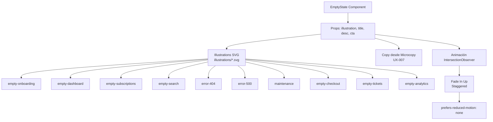

---
tags:
  - kanban/todo
  - type/task
  - domain/UI
  - priority/P1
parent: "[[desarrollo]]"
children: []
depends_on:
  - "[[UI-001]]"
  - "[[UX-004]]"
blocks:
  - "[[CSS-021]]"
  - "[[WEB-001]]"
  - "[[CRE-001]]"
  - "[[ADM-001]]"
status: todo
assignee: "@dev"
created: 2026-08-04
updated: 2026-08-04
---

# [[UI-007]] Ilustraciones/Empty States: 8+ Estados Vacíos Ilustrados

## Descripción
Crear ilustraciones personalizadas para empty states y momentos clave: onboarding, sin resultados, errores, éxito, mantenimiento. Estilo consistente con brand, formatos SVG optimizados.

## Código de Ejemplo
```markdown
# Catálogo Empty States

## 1. Onboarding - Sin Canales (Public Landing)
**Contexto**: Usuario nuevo ve listado vacío
**Ilustración**: Persona explorando con lupa + globo de pensamiento con canal
**Copy**: "Aún no hay canales en esta categoría. Sé el primero en crear uno."
**CTA**: "Crear mi canal" → creadores.onboarding

## 2. Dashboard Creador - Sin Canales
**Contexto**: Creador recién onboarding completado
**Ilustración**: Caja de regalo abriéndose + partículas mágicas
**Copy**: "¡Todo listo! Crea tu primer canal para empezar a monetizar."
**CTA**: "Crear canal" → creadores.channels.create

## 3. Mis Suscripciones - Vacío (Cliente)
**Contexto**: Usuario logueado sin compras
**Ilustración**: Estrella brillante + camino hacia ella
**Copy**: "No tienes accesos activos aún. Descubre contenido exclusivo."
**CTA**: "Explorar canales" → channels.index

## 4. Búsqueda - Sin Resultados
**Contexto**: Filtro/búsqueda sin matches
**Ilustración**: Detective con lupa + rastros vacíos
**Copy**: "No encontramos canales con esos filtros. Intenta ampliar tu búsqueda."
**CTA**: "Limpiar filtros" + "Ver todos los canales"

## 5. Error 404 - Página No Encontrada
**Contexto**: URL inválida
**Ilustración**: Astronauta flotando + nave perdida
**Copy**: "Parece que te perdiste en el espacio. Esta página no existe."
**CTA**: "Volver al inicio" + "Buscar canales"

## 6. Error 500 - Error Servidor
**Contexto**: Error inesperado
**Ilustración**: Robot con humo + herramienta rota
**Copy**: "Algo salió mal de nuestro lado. Nuestro equipo ya lo está arreglando."
**CTA**: "Reintentar" + "Contactar soporte"

## 7. Mantenimiento Programado
**Contexto**: Modo maintenance activado (Admin)
**Ilustración**: Equipo de construcción + grúa
**Copy**: "Estamos mejorando la plataforma. Volvemos en {tiempo_estimado}."
**CTA**: "Suscribirme a actualizaciones" (email capture)

## 8. Checkout - Carrito Vacío / Sesión Expirada
**Contexto**: Usuario vuelve a checkout sin sesión
**Ilustración**: Reloj de arena + carrito transparente
**Copy**: "Tu sesión expiró. El canal te espera."
**CTA**: "Volver al canal" → channels.show

## 9. CRM - Sin Tickets Asignados (Staff)
**Contexto**: Staff sin tickets en cola
**Ilustración**: Buzón vacío + mariposa
**Copy**: "¡Buen trabajo! No hay tickets pendientes. Todo al día."
**CTA**: "Ver todos los tickets" (opcional)

## 10. Analytics - Sin Datos (Creador Nuevo)
**Contexto**: Canal nuevo sin métricas
**Ilustración**: Semilla brotando + gráfico ascendente
**Copy**: "Los datos aparecerán aquí cuando tengas tus primeros suscriptores."
**CTA**: "Ver guía de crecimiento" (link KB)
```

```blade
{{-- Componente Empty State Reutilizable --}}
@props(['illustration', 'title', 'description', 'ctaText', 'ctaUrl', 'secondaryCta'])

<div class="empty-state flex flex-col items-center text-center py-16 px-4">
    <div class="mb-6" x-data="{ loaded: false }" 
         x-intersect:enter="loaded = true" 
         :class="loaded ? 'animate-fade-in-up' : 'opacity-0'">
        <svg class="w-32 h-32 mx-auto text-neutral-300 dark:text-neutral-700" 
             viewBox="0 0 200 200" fill="none" xmlns="http://www.w3.org/2000/svg">
            @include("illustrations.{{ $illustration }}")
        </svg>
    </div>
    
    <h3 class="text-xl font-semibold text-neutral-900 dark:text-neutral-50 mb-2">
        {{ $title }}
    </h3>
    
    <p class="text-neutral-600 dark:text-neutral-400 mb-6 max-w-md mx-auto">
        {{ $description }}
    </p>
    
    <div class="flex flex-col sm:flex-row items-center justify-center gap-3">
        @if($ctaText && $ctaUrl)
            <a href="{{ $ctaUrl }}" class="btn btn--primary">{{ $ctaText }}</a>
        @endif
        @if($secondaryCta)
            <a href="{{ $secondaryCta['url'] }}" class="btn btn--ghost">{{ $secondaryCta['text'] }}</a>
        @endif
    </div>
</div>
```

## Cálculos y Algoritmos (LaTeX)
### Escalado Ilustraciones SVG
$$
\text{ViewBox} = 200 \times 200, \quad \text{Display} = 128 \times 128 \text{px} (32 \times 32 \text{ en rem})
$$
$$
\text{Aspect Ratio} = 1:1 \quad \text{(cuadrado para consistencia)}
$$

### Animación Entrada (Intersection Observer)
$$
\text{Delay} = 100ms \times \text{index}, \quad \text{Duration} = 400ms, \quad \text{Easing} = \text{ease-out}
$$

## Diagramas Mermaid
### Sistema Empty States


## Criterios de Aceptación
- [ ] 10 ilustraciones SVG creadas en `resources/svg/illustrations/`
- [ ] ViewBox consistente 200x200, stroke-width 1.5-2, estilo outline
- [ ] Componente `<x-empty-state>` reutilizable con props
- [ ] Copy desde guía microcopy (UX-007) - tono consistente
- [ ] Animación fade-in-up con Intersection Observer (respeta reduced-motion)
- [ ] Colores: `currentColor` o tokens semánticos (text-muted)
- [ ] Responsive: 128px mobile, 160px desktop
- [ ] Dark mode compatible (stroke color via token)
- [ ] Documentación en `docu/especificaciones/empty-states.md` con catálogo visual

## Notas Técnicas
- Ilustraciones estilo "outline" minimalista (como Undraw, Open Doodles pero custom)
- Paleta: 1 color primario + neutros (max 3 colores por ilustración)
- Optimizar SVGs: SVGO, eliminar metadata, minificar
- Sprites SVG para carga única: `<symbol id="ill-empty-onboarding">`
- Fallback: emoji si SVG falla (raro)

## Enlaces
- [[UX-004]] Wireframes (referencia visual)
- [[UX-007]] Microcopy (copy para cada estado)
- [[UI-001]] Design Tokens (colores, animaciones)
- [[UI-005]] Dark Mode (tokens semánticos)
- [[UI-006]] Iconografía (mismo estilo visual)
- [[CSS-021]] Data Display Component (empty state variant)
- [[PUB-001]] Landing (empty categories)
- [[CRE-001]] Dashboard (empty channels)
- [[CRM-001]] Ticketing (empty queue)