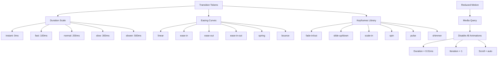

---
tags:
  - kanban/todo
  - type/task
  - domain/UI
  - priority/P1
parent: "[[desarrollo]]"
children: []
depends_on:
  - "[[UI-001]]"
  - "[[UI-002]]"
blocks:
  - "[[CSS-030]]"
  - "[[CSS-007]]"
  - "[[CSS-010]]"
  - "[[CSS-012]]"
  - "[[CSS-013]]"
status: todo
assignee: "@dev"
created: 2026-08-04
updated: 2026-08-04
---

# [[UI-008]] Motion/Transitions: Easing, Duration, Reduced-Motion Support

## Descripción
Definir sistema de motion design: easing curves, duraciones estándar, keyframes reutilizables, y soporte completo para `prefers-reduced-motion`.

## Código de Ejemplo
```json
// tokens/transition.json
{
  "transition": {
    "duration": {
      "instant": { "value": "0ms", "type": "duration" },
      "fast": { "value": "100ms", "type": "duration" },
      "normal": { "value": "200ms", "type": "duration" },
      "slow": { "value": "300ms", "type": "duration" },
      "slower": { "value": "500ms", "type": "duration" }
    },
    "easing": {
      "linear": { "value": "linear", "type": "easing" },
      "ease-in": { "value": "cubic-bezier(0.4, 0, 1, 1)", "type": "easing" },
      "ease-out": { "value": "cubic-bezier(0, 0, 0.2, 1)", "type": "easing" },
      "ease-in-out": { "value": "cubic-bezier(0.4, 0, 0.2, 1)", "type": "easing" },
      "spring": { "value": "cubic-bezier(0.34, 1.56, 0.64, 1)", "type": "easing" },
      "bounce": { "value": "cubic-bezier(0.68, -0.55, 0.265, 1.55)", "type": "easing" }
    }
  }
}
```

```css
/* CSS Custom Properties generadas */
:root {
  --duration-instant: 0ms;
  --duration-fast: 100ms;
  --duration-normal: 200ms;
  --duration-slow: 300ms;
  --duration-slower: 500ms;
  
  --easing-linear: linear;
  --easing-in: cubic-bezier(0.4, 0, 1, 1);
  --easing-out: cubic-bezier(0, 0, 0.2, 1);
  --easing-in-out: cubic-bezier(0.4, 0, 0.2, 1);
  --easing-spring: cubic-bezier(0.34, 1.56, 0.64, 1);
  --easing-bounce: cubic-bezier(0.68, -0.55, 0.265, 1.55);
}

/* Keyframes reutilizables */
@keyframes fade-in {
  from { opacity: 0; }
  to { opacity: 1; }
}

@keyframes fade-out {
  from { opacity: 1; }
  to { opacity: 0; }
}

@keyframes slide-up {
  from { opacity: 0; transform: translateY(10px); }
  to { opacity: 1; transform: translateY(0); }
}

@keyframes slide-down {
  from { opacity: 0; transform: translateY(-10px); }
  to { opacity: 1; transform: translateY(0); }
}

@keyframes scale-in {
  from { opacity: 0; transform: scale(0.95); }
  to { opacity: 1; transform: scale(1); }
}

@keyframes spin {
  from { transform: rotate(0deg); }
  to { transform: rotate(360deg); }
}

@keyframes pulse {
  0%, 100% { opacity: 1; }
  50% { opacity: 0.5; }
}

@keyframes shimmer {
  0% { background-position: -200% 0; }
  100% { background-position: 200% 0; }
}

/* Animaciones utilitarias */
.animate-fade-in { animation: fade-in var(--duration-normal) var(--easing-out); }
.animate-fade-out { animation: fade-out var(--duration-fast) var(--easing-in); }
.animate-slide-up { animation: slide-up var(--duration-normal) var(--easing-out); }
.animate-slide-down { animation: slide-down var(--duration-normal) var(--easing-out); }
.animate-scale-in { animation: scale-in var(--duration-fast) var(--easing-spring); }
.animate-spin { animation: spin 1s linear infinite; }
.animate-pulse { animation: pulse 2s var(--easing-in-out) infinite; }
.animate-shimmer { animation: shimmer 2s infinite; background: linear-gradient(90deg, transparent, rgba(255,255,255,0.4), transparent); background-size: 200% 100%; }

/* Transiciones estándar */
.transition-base { transition: all var(--duration-normal) var(--easing-out); }
.transition-colors { transition: color var(--duration-fast) var(--easing-out), background-color var(--duration-fast) var(--easing-out), border-color var(--duration-fast) var(--easing-out); }
.transition-transform { transition: transform var(--duration-normal) var(--easing-out); }
.transition-opacity { transition: opacity var(--duration-fast) var(--easing-out); }

/* Reduced Motion - CRÍTICO */
@media (prefers-reduced-motion: reduce) {
  *, *::before, *::after {
    animation-duration: 0.01ms !important;
    animation-iteration-count: 1 !important;
    transition-duration: 0.01ms !important;
    scroll-behavior: auto !important;
  }
  
  .animate-spin { animation: none; }
  .animate-pulse { animation: none; opacity: 1; }
}
```

```javascript
// Hook para animaciones condicionales (Alpine.js)
document.addEventListener('alpine:init', () => {
    Alpine.magic('motion', () => ({
        prefersReducedMotion: () => window.matchMedia('(prefers-reduced-motion: reduce)').matches,
        duration: (speed = 'normal') => {
            const durations = { instant: 0, fast: 100, normal: 200, slow: 300, slower: 500 };
            return this.prefersReducedMotion() ? 0 : durations[speed];
        }
    }));
});
```

## Cálculos y Algoritmos (LaTeX)
### Curvas de Easing (Cubic Bezier)
$$
B(t) = (1-t)^3 P_0 + 3(1-t)^2 t P_1 + 3(1-t) t^2 P_2 + t^3 P_3
$$

| Easing | P1 | P2 | Uso |
|--------|-----|-----|-----|
| ease-out | (0, 0) | (0.2, 1) | Entrada elementos, modales |
| ease-in-out | (0.4, 0) | (0.2, 1) | Transiciones estado |
| spring | (0.34, 1.56) | (0.64, 1) | Botones, feedback táctil |
| bounce | (0.68, -0.55) | (0.265, 1.55) | Notificaciones, celebrations |

### Duración por Distancia/Complejidad
$$
\text{Duration} = \text{base} \times \log_2(\text{distance} / \text{threshold} + 1)
$$
Base: 200ms, Threshold: 100px

## Diagramas Mermaid
### Sistema de Animaciones


## Criterios de Aceptación
- [ ] Tokens de transición en `tokens/transition.json` (duraciones + easings)
- [ ] CSS Custom Properties generadas para durations y easings
- [ ] 8 keyframes reutilizables (fade, slide, scale, spin, pulse, shimmer)
- [ ] 4 utilidades de transición base (all, colors, transform, opacity)
- [ ] `prefers-reduced-motion` desactiva TODAS las animaciones
- [ ] Testing: Chrome DevTools → Rendering → "Emulate prefers-reduced-motion"
- [ ] Documentación en `docu/especificaciones/motion-design.md`
- [ ] Guía de uso: qué easing para qué caso (tabla)

## Notas Técnicas
- No animar propiedades que causan layout: width, height, top, left → usar transform
- `will-change` solo en elementos que realmente animan (performance)
- Reduced motion: no solo desactivar, sino proporcionar feedback alternativo inmediato
- Loading states: skeleton (shimmer) vs spinner (spin) según contexto
- Page transitions: evaluar View Transitions API para v1.1

## Enlaces
- [[UI-001]] Design Tokens (transition tokens)
- [[UI-002]] Component Library (Button loading, Modal enter/exit, Toast, Tooltip)
- [[UI-005]] Dark Mode (transición tema)
- [[CSS-030]] Transition Utilities
- [[CSS-007]] Button (loading spinner, hover/tap)
- [[CSS-010]] Modal (slide-up + fade)
- [[CSS-012]] Dropdown (scale-in)
- [[CSS-013]] Tabs (slide)
- [[CSS-014]] Toast (slide-down + fade)
- [[CSS-015]] Tooltip (fade + scale)
- [[CSS-033]] Accesibilidad (reduced-motion)