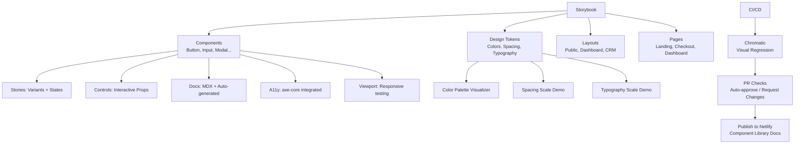

---
tags:
  - kanban/todo
  - type/task
  - domain/UI
  - priority/P2
parent: "[[desarrollo]]"
children: []
depends_on:
  - "[[UI-001]]"
  - "[[UI-002]]"
blocks:
  - "[[CSS-036]]"
  - "[[CSS-037]]"
status: todo
assignee: "@dev"
created: 2026-08-04
updated: 2026-08-04
---

# [[UI-009]] Storybook/Documentación Componentes Viva (Opcional v1.1)

## Descripción
Configurar Storybook para documentación viva de componentes UI. Incluir: stories por componente, controles interactivos, docs MDX, testing visual, y deployment a Chromatic/Netlify.

## Código de Ejemplo
```bash
# Instalar Storybook
npx storybook@latest init --type vue3 --builder vite
# o para Laravel Blade (custom)
npm install --save-dev @storybook/html @storybook/addon-essentials @storybook/addon-interactions @storybook/addon-links @storybook/blocks @storybook/test @storybook/addon-a11y storybook-addon-paddings
```

```javascript
// .storybook/main.js
/** @type { import('@storybook/html').Preview } */
const preview = {
  parameters: {
    actions: { argTypesRegex: '^on[A-Z].*' },
    controls: {
      matchers: {
        color: /(background|color)$/i,
        date: /Date$/i,
      },
    },
    backgrounds: {
      default: 'light',
      values: [
        { name: 'light', value: '#ffffff' },
        { name: 'dark', value: '#0a0a0a' },
        { name: 'primary', value: '#2563eb' },
      ],
    },
    layout: 'centered',
    a11y: {
      config: {
        rules: [{ id: 'color-contrast', enabled: true }],
      },
    },
  },
  globalTypes: {
    theme: {
      description: 'Global theme for components',
      defaultValue: 'light',
      toolbar: {
        title: 'Theme',
        icon: 'circlehollow',
        items: ['light', 'dark', 'system'],
        dynamicTitle: true,
      },
    },
  },
  decorators: [
    (Story, context) => {
      const theme = context.globals.theme;
      document.documentElement.dataset.theme = theme;
      return Story();
    },
  ],
};

export default preview;
```

```javascript
// stories/Button.stories.js
import { html } from 'lit-html';

export default {
  title: 'Components/Button',
  component: 'tgp-button',
  argTypes: {
    variant: {
      control: 'select',
      options: ['primary', 'secondary', 'ghost', 'danger', 'success'],
      description: 'Visual style variant',
    },
    size: {
      control: 'select',
      options: ['sm', 'md', 'lg', 'xl'],
      description: 'Size variant',
    },
    disabled: {
      control: 'boolean',
      description: 'Disabled state',
    },
    loading: {
      control: 'boolean',
      description: 'Loading state with spinner',
    },
    fullWidth: {
      control: 'boolean',
      description: 'Full width button',
    },
  },
  parameters: {
    docs: {
      description: {
        component: 'Primary button component with multiple variants and states.',
      },
    },
    a11y: {
      config: {
        rules: [{ id: 'button-name', enabled: true }],
      },
    },
  },
};

const Template = (args) => html`
  <tgp-button
    variant=${args.variant}
    size=${args.size}
    ?disabled=${args.disabled}
    ?loading=${args.loading}
    ?fullWidth=${args.fullWidth}
  >
    ${args.children}
  </tgp-button>
`;

export const Primary = Template.bind({});
Primary.args = { variant: 'primary', size: 'md', children: 'Botón Primario' };

export const Secondary = Template.bind({});
Secondary.args = { variant: 'secondary', size: 'md', children: 'Botón Secundario' };

export const Ghost = Template.bind({});
Ghost.args = { variant: 'ghost', size: 'md', children: 'Botón Ghost' };

export const Danger = Template.bind({});
Danger.args = { variant: 'danger', size: 'md', children: 'Botón Peligro' };

export const Loading = Template.bind({});
Loading.args = { variant: 'primary', size: 'md', loading: true, children: 'Cargando...' };

export const Disabled = Template.bind({});
Disabled.args = { variant: 'primary', size: 'md', disabled: true, children: 'Deshabilitado' };

export const AllVariants = () => html`
  <div style="display: flex; flex-wrap: wrap; gap: 1rem; align-items: center;">
    <tgp-button variant="primary">Primario</tgp-button>
    <tgp-button variant="secondary">Secundario</tgp-button>
    <tgp-button variant="ghost">Ghost</tgp-button>
    <tgp-button variant="danger">Peligro</tgp-button>
    <tgp-button variant="success">Éxito</tgp-button>
  </div>
`;

export const AllSizes = () => html`
  <div style="display: flex; flex-wrap: wrap; gap: 1rem; align-items: center;">
    <tgp-button size="sm">Small</tgp-button>
    <tgp-button size="md">Medium</tgp-button>
    <tgp-button size="lg">Large</tgp-button>
    <tgp-button size="xl">Extra Large</tgp-button>
  </div>
`;
```

```markdown
# .storybook/preview-head.html (para CSS Framework)
<link rel="stylesheet" href="/build/framework.css">
<script src="/build/framework.js" type="module"></script>
```

## Cálculos y Algoritmos (LaTeX)
### Cobertura de Stories
$$
\text{Cobertura} = \frac{\text{Componentes con stories}}{\text{Componentes totales}} \times 100 = 100\%
$$

### Testing Visual (Chromatic)
$$
\text{Baseline} = \text{Primera build} \\
\text{Diff} = \text{Pixel-by-pixel comparison} \\
\text{Threshold} = 0.1\% \text{ pixel difference}
$$

## Diagramas Mermaid
### Arquitectura Storybook


## Criterios de Aceptación
- [ ] Storybook configurado para HTML/Blade components (via Web Components wrapper)
- [ ] Stories para 15 componentes (UI-002) con variants, states, controls
- [ ] MDX docs pages: Introduction, Getting Started, Design Tokens, Layouts
- [ ] Theme toggle en toolbar (light/dark/system)
- [ ] Viewport addon para testing responsive (320, 768, 1024, 1440)
- [ ] A11y addon (axe-core) passing en todos los stories
- [ ] Chromatic configurado para visual regression testing
- [ ] Deploy automático a Netlify/Vercel en merge a main
- [ ] Documentado en `docu/especificaciones/storybook-setup.md`

## Notas Técnicas
- Opcional v1.0, obligatorio v1.1 (marcar como P3/P2 según prioridad)
- Para Blade components: crear Web Components wrappers o usar `@storybook/html` con templates
- Alternative: `histoire` (Vue/React) o `ladle` (más ligero)
- CSS Framework debe estar buildeado y servido en Storybook
- Chromatic gratis para proyectos open source / 5000 snapshots/mes

## Enlaces
- [[UI-002]] Component Library (fuente de componentes)
- [[UI-001]] Design Tokens (visualizador)
- [[UI-003]] Layouts (stories de páginas completas)
- [[CSS-034]] Build System (output para Storybook)
- [[CSS-036]] Documentación Viva (esta tarea)
- [[CSS-037]] Testing Visual (Chromatic)
- [[TST-P-009]] Lighthouse CI (performance)