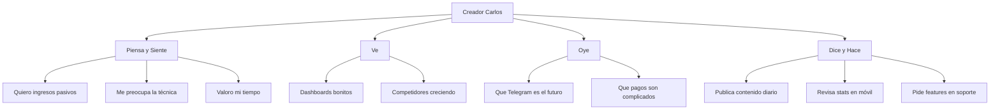

---
tags:
  - kanban/todo
  - type/task
  - domain/UX
  - priority/P1
parent: "[[desarrollo]]"
children: []
depends_on:
  - "[[FUN-001]]"
blocks:
  - "[[UX-002]]"
  - "[[UX-003]]"
  - "[[UX-004]]"
  - "[[UI-001]]"
  - "[[UX-005]]"
  - "[[UX-007]]"
status: todo
assignee: "@dev"
created: 2026-08-04
updated: 2026-08-04
---

# [[UX-001]] User Research: Proto-personas (Creador, Usuario, Staff, Admin)

## Descripción
Definir 4 proto-personas principales basadas en investigación de mercado y stakeholders. Cada persona incluye demografía, objetivos, frustraciones, comportamientos y journey mapping.

## Código de Ejemplo
```markdown
# Proto-persona: Creador de Contenido "Carlos"
## Demografía
- Edad: 28-40 años
- Ubicación: Latam/España
- Ingresos: $2,000-$10,000/mes de contenido
- Experiencia técnica: Media (sabe usar Telegram, no programador)

## Objetivos
- Monetizar audiencia de Telegram sin fricción
- Automatizar pagos y accesos
- Escalar sin soporte manual
- Métricas claras de ingresos

## Frustraciones
- Gestión manual de invitaciones
- Pagos fallidos sin notificación
- Expulsar usuarios expirados a mano
- Falta de analytics de retención

## Comportamientos
- Usa móvil 80% del tiempo
- Revisa stats diario en dashboard
- Prefiere configurar una vez y olvidar
- Valora simplicidad sobre features complejos

## Journey Principal
Onboarding → Configurar Canal → Primer Pago → Escalar
```

```markdown
# Proto-persona: Usuario Final "María"
## Demografía
- Edad: 22-35 años
- Usuario activo de Telegram
- Dispuesta a pagar por contenido premium
- Valora privacidad y simplicidad

## Objetivos
- Acceder a contenido exclusivo rápido
- Pago seguro y transparente
- Renovación automática sin sorpresas
- Soporte rápido si hay problemas

## Frustraciones
- Enlaces de invitación rotos
- Pagos rechazados sin explicación
- Proceso de compra complicado
- Falta de facturas claras
```

## Cálculos y Algoritmos (LaTeX)
### Matriz de Prioridad de Features por Persona
$$
\begin{array}{c|cccc}
\text{Feature} & \text{Creador} & \text{Usuario} & \text{Staff} & \text{Admin} \\
\hline
\text{Onboarding guiado} & 5 & 1 & 2 & 3 \\
\text{Checkout 1-click} & 3 & 5 & 1 & 2 \\
\text{Analytics MRR/Churn} & 5 & 1 & 3 & 5 \\
\text{Ticketing SLA} & 2 & 4 & 5 & 3 \\
\text{Feature Flags} & 1 & 1 & 2 & 5 \\
\end{array}
$$
Escala: 1=Baja, 5=Crítica

## Diagramas Mermaid
### Mapa de Empatía - Creador


## Criterios de Aceptación
- [ ] 4 proto-personas documentadas en `docu/especificaciones/personas.md`
- [ ] Cada persona: demografía, objetivos, frustraciones, comportamientos, journey
- [ ] Matriz de prioridad features × persona completada
- [ ] Mapas de empatía para cada persona (Mermaid)
- [ ] Validadas con stakeholders reales si posible
- [ ] Documentadas en Obsidian con frontmatter y wikienlaces

## Notas Técnicas
- Guardar en `docu/especificaciones/personas.md` con frontmatter
- Usar como base para UX-002 (journey maps) y UX-003 (user flows)
- Referenciar en UI-001 (design tokens) para decisiones de color/tipografía
- Actualizar tras usability testing (UX-008)

## Enlaces
- [[FUN-001]] Proyecto Base
- [[UX-002]] Journey Maps
- [[UX-003]] User Flows
- [[UX-004]] Wireframes
- [[UI-001]] Design Tokens