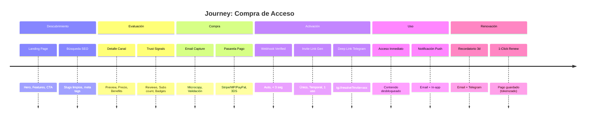

---
tags:
  - kanban/todo
  - type/task
  - domain/UX
  - priority/P1
parent: "[[desarrollo]]"
children: []
depends_on:
  - "[[UX-001]]"
blocks:
  - "[[UX-003]]"
  - "[[UX-004]]"
  - "[[UI-003]]"
status: todo
assignee: "@dev"
created: 2026-08-04
updated: 2026-08-04
---

# [[UX-002]] Journey Maps: 4 Journeys Principales

## Descripción
Crear journey maps detallados para los 4 viajes críticos: Compra de Acceso, Onboarding Creador, Ticket Soporte CRM, Configuración Admin. Incluir touchpoints, emociones, oportunidades de mejora.

## Código de Ejemplo
```markdown
# Journey: Compra de Acceso (Usuario Final)
## Fases
1. **Descubrimiento** - Ve canal en landing/búsqueda
2. **Evaluación** - Revisa detalle, precio, beneficios
3. **Compra** - Click "Comprar" → Email → Pago
4. **Activación** - Webhook → Invite Link → Telegram
5. **Uso** - Accede al canal/grupo
6. **Renovación** - Recordatorio → Pago automático

## Touchpoints por Fase
| Fase | Touchpoint | Canal | Emoción | Oportunidad |
|------|------------|-------|---------|-------------|
| Descubrimiento | Landing page | Web | Curiosidad | Hero claro, social proof |
| Evaluación | Detalle canal | Web | Interés/Duda | Benefits claros, trust signals |
| Compra | Form email | Web | Ansiedad | Microcopy tranquilizador |
| Compra | Pasarela pago | Externo | Estrés | Múltiples métodos, seguro |
| Activación | Email + Telegram | Email/Telegram | Alegría | Deep link directo a app |
| Uso | Canal Telegram | Telegram | Satisfacción | Contenido inmediato |
| Renovación | Email recordatorio | Email | Neutral | 1-click renewal |

## Métricas Clave
- Conversion rate: Landing → Checkout > 3%
- Checkout completion: > 70%
- Time to access: < 2 min post-pago
- Churn mensual: < 5%
```

```markdown
# Journey: Onboarding Creador
## Fases
1. **Registro** - Landing creadores → Form → Email verify
2. **Wizard Paso 1** - Datos personales/fiscales
3. **Wizard Paso 2** - Vincular Bot + Canal/Grupo
4. **Wizard Paso 3** - Configurar Precios + Moneda
5. **Wizard Paso 4** - Método Pago (Stripe Connect/MP)
6. **Activación** - Primer canal público → Primer venta

## Pain Points Críticos
- Vincular bot: token, permissions, webhook URL
- Configurar precios: trials, monedas, impuestos
- KYC básico para pagos (Stripe Connect onboarding)
```

## Cálculos y Algoritmos (LaTeX)
### Métricas de Conversión por Journey
$$
\begin{aligned}
\text{Compra} &: \text{CR} = \frac{\text{Compras}}{\text{Visitas Detalle}} \times 100 > 3\% \\
\text{Onboarding} &: \text{Completion} = \frac{\text{Creadores Activos}}{\text{Registrados}} \times 100 > 40\% \\
\text{Ticket CRM} &: \text{FCR} = \frac{\text{Resueltos 1er Contacto}}{\text{Total Tickets}} \times 100 > 70\% \\
\text{Admin Config} &: \text{Time-to-Value} < 10 \text{ min}
\end{aligned}
$$

### Cálculo de Time-to-Value
$$
TTV = \sum_{i=1}^{n} t_i \quad \text{donde } t_i = \text{tiempo en paso } i
$$

## Diagramas Mermaid
### Journey Map - Compra (Mermaid Timeline)


## Criterios de Aceptación
- [ ] 4 journey maps documentados en `docu/especificaciones/journey-maps.md`
- [ ] Cada journey: fases, touchpoints, emociones, métricas, oportunidades
- [ ] Timeline visual Mermaid para cada journey
- [ ] Pain points priorizados (impacto × frecuencia)
- [ ] KPIs definidos por journey con targets
- [ ] Referencias a proto-personas (UX-001)

## Notas Técnicas
- Usar formato Mermaid `timeline` o `journey` para visualización
- Guardar en `docu/especificaciones/journey-maps.md`
- Base para UX-003 (user flows detallados) y UI-003 (layouts)
- Validar con analytics reales post-lanzamiento

## Enlaces
- [[UX-001]] Proto-personas
- [[UX-003]] User Flows
- [[UX-004]] Wireframes
- [[PUB-004]] Checkout Flow
- [[CRE-001]] Onboarding Creador
- [[CRM-001]] Ticketing