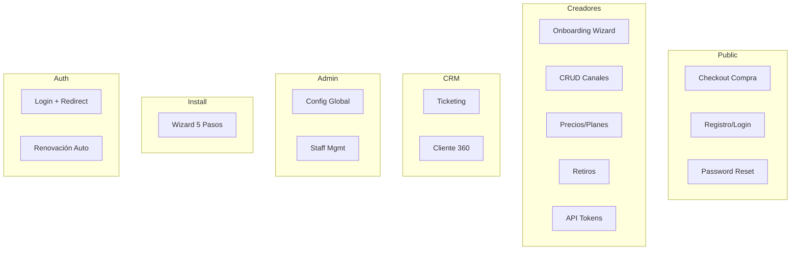

---
tags:
  - kanban/todo
  - type/task
  - domain/UX
  - priority/P1
parent: "[[desarrollo]]"
children: []
depends_on:
  - "[[UX-002]]"
blocks:
  - "[[UX-004]]"
  - "[[UI-003]]"
  - "[[PUB-001]]"
  - "[[CRE-001]]"
  - "[[ADM-001]]"
  - "[[CRM-001]]"
status: todo
assignee: "@dev"
created: 2026-08-04
updated: 2026-08-04
---

# [[UX-003]] User Flows: 12+ Flows Documentados (Mermaid)

## Descripción
Documentar 12+ user flows detallados con diagramas Mermaid `flowchart` cubriendo todos los caminos principales y alternativos (errores, edge cases).

## Código de Ejemplo
```mermaid
# Flow: Checkout Completo
flowchart TD
    A[Usuario en /canal/slug] --> B{Logueado?}
    B -->|No| C[Modal Login/Register]
    B -->|Sí| D[Click Comprar]
    C --> E{Email verificado?}
    E -->|No| F[Enviar verification email]
    E -->|Sí| D
    F --> G[Usuario verifica email]
    G --> D
    D --> H[Paso 1: Confirmar Email]
    H --> I[Paso 2: Seleccionar Método Pago]
    I --> J{Stripe/MP/PayPal?}
    J -->|Stripe| K[Redirect Stripe Checkout]
    J -->|MP| L[Redirect MP Checkout]
    J -->|PayPal| M[Redirect PayPal]
    K --> N[Webhook Stripe]
    L --> N
    M --> N
    N --> O{Pago Aprobado?}
    O -->|No| P[Error Page + Reintentar]
    O -->|Sí| Q[Crear Suscripción BD]
    Q --> R[Generar Invite Link Telegram API]
    R --> S{API OK?}
    S -->|No| T[Log Error + Reintentar Job]
    S -->|Sí| U[Enviar Email + Notif Telegram]
    U --> V[Redirect /checkout/success]
    V --> W[Deep Link tg://invite]
    W --> X[Usuario en Canal Telegram]
```

```mermaid
# Flow: Onboarding Creador (Wizard 4 pasos)
flowchart TD
    A[Registro Creador] --> B[Email Verification]
    B --> C[Paso 1: Datos Personales/Fiscales]
    C --> D{Validación?}
    D -->|Error| C
    D -->|OK| E[Paso 2: Vincular Bot]
    E --> F[Input Bot Token]
    F --> G[Test API getMe]
    G --> H{Token Válido?}
    H -->|No| F
    H -->|OK| I[Select Canal/Grupo]
    I --> J[getChat + getChatMember]
    J --> K{Es Admin?}
    K -->|No| I
    K -->|OK| L[Paso 3: Precios]
    L --> M[Config Planes: Mensual/Anual/Trial]
    M --> N[Paso 4: Método Pago]
    N --> O[Stripe Connect Onboarding]
    O --> P{Completado?}
    P -->|No| O
    P -->|Sí| Q[Dashboard Creador Activo]
```

## Lista de 12+ Flows Requeridos

| # | Flow | Dominio | Complejidad |
|---|------|---------|-------------|
| 1 | Checkout Compra | Public | Alta |
| 2 | Registro + Email Verification | Public/Auth | Media |
| 3 | Password Reset | Public/Auth | Media |
| 4 | Onboarding Creador (Wizard 4 pasos) | Creadores | Alta |
| 5 | Crear/Editar Canal | Creadores | Media |
| 6 | Configurar Precios/Planes | Creadores | Media |
| 7 | Solicitar Retiro/Payout | Creadores | Media |
| 8 | Gestionar API Tokens | Creadores | Baja |
| 9 | Crear/Responder Ticket | CRM | Media |
| 10 | Cliente 360 View | CRM | Media |
| 11 | Configuración Global Admin | Admin | Media |
| 12 | Gestión Staff + Roles | Admin | Media |
| 13 | Instalador 5 Pasos | Install | Alta |
| 14 | Login + Subdomain Redirect | Auth | Media |
| 15 | Renovación Suscripción | Public/Background | Baja |

## Cálculos y Algoritmos (LaTeX)
### Complejidad de Flow (Ciclomática)
$$
M = E - N + 2P
$$
Donde: E=edges, N=nodes, P=connected components. Target M < 15 por flow.

### Cobertura de Paths
$$
\text{Cobertura} = \frac{\text{Paths probados}}{\text{Paths totales}} \times 100 > 80\%
$$

## Diagramas Mermaid
### Índice de Flows (Mermaid Graph)


## Criterios de Aceptación
- [ ] 15 flows documentados en `docu/especificaciones/user-flows.md`
- [ ] Cada flow: diagrama Mermaid `flowchart` completo
- [ ] Incluye happy path + error paths + edge cases
- [ ] Nodos de decisión claros (diamantes en Mermaid)
- [ ] Referencias a journey maps (UX-002) y proto-personas (UX-001)
- [ ] Complejidad ciclomática < 15 por flow
- [ ] Documentados en español con frontmatter Obsidian

## Notas Técnicas
- Usar `flowchart TD` (top-down) para legibilidad
- Colores semánticos: verde=éxito, rojo=error, amarillo=decisión, azul=proceso
- Guardar en `docu/especificaciones/user-flows.md`
- Base para wireframes (UX-004) y tests E2E (TST-F-012)

## Enlaces
- [[UX-001]] Proto-personas
- [[UX-002]] Journey Maps
- [[UX-004]] Wireframes
- [[UI-003]] Layouts Base
- [[TST-F-012]] Browser Tests Dusk