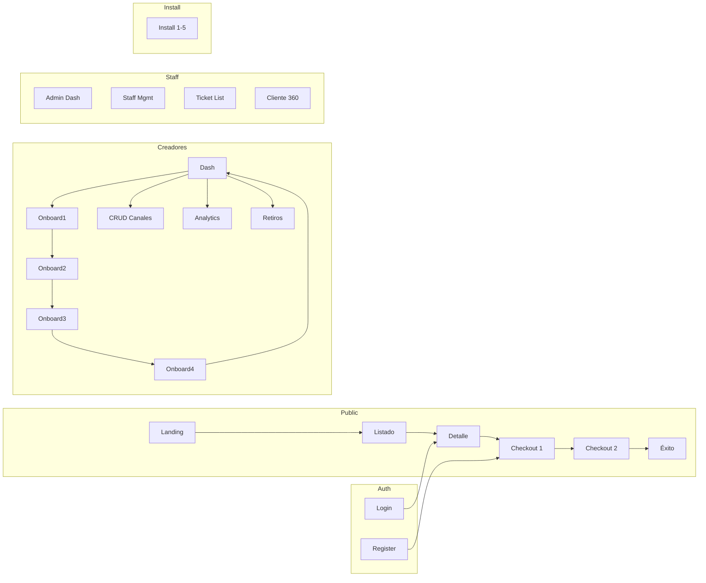

---
tags:
  - kanban/todo
  - type/task
  - domain/UX
  - priority/P1
parent: "[[desarrollo]]"
children: []
depends_on:
  - "[[UX-003]]"
blocks:
  - "[[UI-002]]"
  - "[[UI-003]]"
  - "[[PUB-001]]"
  - "[[CRE-001]]"
  - "[[ADM-001]]"
  - "[[CRM-001]]"
  - "[[UI-007]]"
  - "[[UX-006]]"
  - "[[UX-008]]"
  - "[[WEB-001]]"
  - "[[WEB-004]]"
status: todo
assignee: "@dev"
created: 2026-08-04
updated: 2026-08-04
---

# [[UX-004]] Wireframes Low-Fi: 20+ Pantallas (Figma/Excalidraw)

## Descripción
Crear wireframes de baja fidelidad para 20+ pantallas clave usando Figma o Excalidraw. Exportar a `docu/especificaciones/wireframes/` como PNG/SVG + fuente .excalidraw/.fig.

## Lista de Pantallas Requeridas

| # | Pantalla | Dominio | Dispositivos |
|---|----------|---------|--------------|
| 1 | Landing Page | Public | Mobile, Desktop |
| 2 | Listado Canales (con filtros) | Public | Mobile, Desktop |
| 3 | Detalle Canal | Public | Mobile, Desktop |
| 4 | Checkout Paso 1: Email | Public | Mobile, Desktop |
| 5 | Checkout Paso 2: Pago | Public | Mobile, Desktop |
| 6 | Checkout Éxito + Deep Link | Public | Mobile, Desktop |
| 7 | Login / Register | Auth | Mobile, Desktop |
| 8 | Password Reset | Auth | Mobile |
| 9 | Dashboard Creador | Creadores | Desktop, Tablet |
| 10 | Onboarding Paso 1: Datos | Creadores | Mobile, Desktop |
| 11 | Onboarding Paso 2: Bot + Canal | Creadores | Desktop |
| 12 | Onboarding Paso 3: Precios | Creadores | Desktop |
| 13 | Onboarding Paso 4: Pagos | Creadores | Desktop |
| 14 | CRUD Canales (Lista + Form) | Creadores | Desktop |
| 15 | Analytics Canal | Creadores | Desktop |
| 16 | Retiros/Payouts | Creadores | Desktop |
| 17 | Dashboard Admin | Admin | Desktop |
| 18 | Gestión Staff | Admin | Desktop |
| 19 | Ticket List + Detail | CRM | Desktop |
| 20 | Cliente 360 View | CRM | Desktop |
| 21 | Instalador Paso 1-5 | Install | Mobile, Desktop |
| 22 | Error 404 / 500 | Global | Mobile, Desktop |

## Código de Ejemplo
```mermaid
# Estructura wireframe landing (Mermaid para documentación)
flowchart TD
    subgraph "Landing Page - Mobile"
        L1[Header: Logo + CTA]
        L2[Hero: Headline + Subhead + CTA Principal]
        L3[Social Proof: Logos + Testimonios]
        L4[Features: 3 Columnas ícono+texto]
        L5[How it Works: 3 Pasos numerados]
        L6[Pricing: 3 Planes toggle mensual/anual]
        L7[FAQ: Acordeón]
        L8[Footer: Links + Newsletter]
    end
    
    subgraph "Landing Page - Desktop"
        LD1[Header: Logo + Nav + CTA]
        LD2[Hero: Headline + Subhead + CTA + Ilustración]
        LD3[Social Proof: Carousel]
        LD4[Features: Grid 3 cols + hover]
        LD5[How it Works: Horizontal scroll]
        LD6[Pricing: Table comparativa]
        LD7[FAQ: Side-by-side]
        LD8[Footer: 4 Columnas + Newsletter]
    end
```

```markdown
# Anotaciones Wireframe (ejemplo Detalle Canal)
## Elementos Clave
- [ ] Header con breadcrumb: Inicio > Categorías > Finanzas > Canal
- [ ] Hero: Imagen portada + Título + Badge "Verificado" + Precio
- [ ] Meta: Categoría + Suscriptores + Rating + Última actualización
- [ ] Descripción: Texto rico + Lista beneficios (checkmarks)
- [ ] Preview: Últimos 3 posts (blur si no suscrito)
- [ ] CTA Principal: "Comprar Acceso - $X/mes" (sticky en mobile)
- [ ] Trust: "Pago seguro", "Acceso inmediato", "Cancelar 언제"
- [ ] Footer: Términos + Privacidad + Soporte
```

## Cálculos y Algoritmos (LaTeX)
### Grid Responsive para Wireframes
$$
\text{Breakpoints}: \{ \text{Mobile}: <640px, \text{Tablet}: 640-1024px, \text{Desktop}: >1024px \}
$$

### Densidad de Información
$$
\text{Mobile}: 1 \text{ col}, \quad \text{Tablet}: 2 \text{ cols}, \quad \text{Desktop}: 3-4 \text{ cols}
$$

## Diagramas Mermaid
### Navegación entre Wireframes


## Criterios de Aceptación
- [ ] 22 wireframes creados (mobile + desktop donde aplique)
- [ ] Exportados a `docu/especificaciones/wireframes/` (PNG/SVG)
- [ ] Fuentes editables guardadas (.excalidraw o .fig)
- [ ] Anotaciones de interacciones y estados (hover, focus, error, loading)
- [ ] Navegación documentada entre pantallas
- [ ] Componentes reutilizables identificados (para UI-002)
- [ ] Accesibilidad: orden tab, contrastes, labels

## Notas Técnicas
- Excalidraw recomendado (gratis, open source, exporta Mermaid-compatible)
- Naming: `wireframe-{dominio}-{pantalla}-{device}.excalidraw.png`
- Referenciar en `docu/especificaciones/wireframes/README.md` con índice
- Base para UI-002 (component library) y UI-003 (layouts)

## Enlaces
- [[UX-003]] User Flows
- [[UI-001]] Design Tokens
- [[UI-002]] Component Library
- [[UI-003]] Layouts Base
- [[PUB-001]] Landing Page
- [[CRE-001]] Onboarding Creador