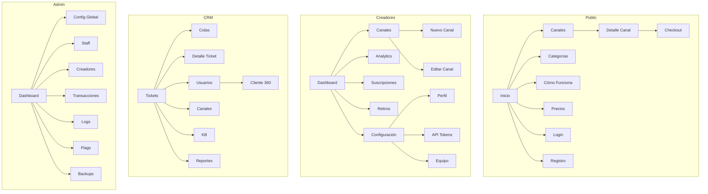

---
tags:
  - kanban/todo
  - type/task
  - domain/UX
  - priority/P2
parent: "[[desarrollo]]"
children: []
depends_on:
  - "[[UX-001]]"
blocks:
  - "[[UI-001]]"
  - "[[UI-005]]"
  - "[[WEB-006]]"
  - "[[UI-003]]"
status: todo
assignee: "@dev"
created: 2026-08-04
updated: 2026-08-04
---

# [[UX-005]] Arquitectura de Información + Card Sorting

## Descripción
Definir la arquitectura de información completa: navegación principal, secundaria, estructura de dashboards, taxonomías de contenido. Realizar card sorting virtual para validar con usuarios.

## Código de Ejemplo
```markdown
# Navegación Principal por Dominio

## Public (public.domain)
- Inicio
- Canales (con filtros: Categoría, Precio, Rating)
- Categorías
- Cómo Funciona
- Precios
- Login / Registro

## Creadores (creadores.domain)
- Dashboard (Resumen MRR, Subs, Churn)
- Canales (Lista + Nuevo)
- Analytics (Por canal + Agregado)
- Suscripciones (Gestión + Filtros)
- Retiros (Historial + Solicitar)
- Configuración
  - Perfil
  - Notificaciones
  - API Tokens
  - Equipo
  - Facturación
- Soporte

## CRM (crm.domain)
- Tickets (Colas: Sin asignar, Míos, Equipo, Escalados)
- Usuarios (Buscar + 360)
- Canales (Moderación)
- Base de Conocimiento
- Reportes
- Configuración (Automatizaciones, SLAs, Macros)

## Admin (admin.domain)
- Dashboard Global (KPIs)
- Configuración Global
- Gestión Staff
- Gestión Creadores
- Transacciones
- Logs Seguridad
- Feature Flags
- Backups
```

```mermaid
# Taxonomía de Canales (Card Sorting Resultado)
graph TD
    A[Canales] --> B[Finanzas e Inversión]
    A --> C[Tecnología y Programación]
    A --> D[Marketing y Negocios]
    A --> E[Salud y Bienestar]
    A --> F[Educación y Cursos]
    A --> G[Entretenimiento]
    A --> H[Criptomonedas]
    A --> I[Otros]
    
    B --> B1[Trading]
    B --> B2[Inversión a Largo Plazo]
    B --> B3[Análisis Fundamental]
    
    C --> C1[Desarrollo Web]
    C --> C2[IA/ML]
    C --> C3[DevOps]
```

## Cálculos y Algoritmos (LaTeX)
### Métricas Card Sorting
$$
\text{Acuerdo} = \frac{\sum \text{agrupaciones similares}}{\text{total participantes}} \times 100
$$

### Profundidad de Navegación
$$
\text{Profundidad Máxima} = 3 \text{ clicks (regla UX)}
$$

## Diagramas Mermaid
### Sitemap Completo


## Criterios de Aceptación
- [ ] Sitemap completo documentado en `docu/especificaciones/ia-sitemap.md`
- [ ] Navegación por dominio (4 sitemaps)
- [ ] Taxonomía de categorías de canales (mínimo 8 categorías principales)
- [ ] Card sorting realizado con 5+ usuarios (resultados documentados)
- [ ] Profundidad máxima 3 clicks validada
- [ ] Etiquetado consistente (nomenclatura unificada)
- [ ] Breadcrumbs definidos para cada nivel

## Notas Técnicas
- Usar herramientas: OptimalSort, Miro, o FigJam para card sorting remoto
- Documentar resultados cuantitativos (similitud %) y cualitativos (comentarios)
- Base para UI-003 (layouts) y UI-004 (responsive breakpoints)
- Guardar en `docu/especificaciones/ia-sitemap.md` y `docu/especificaciones/card-sorting-results.md`

## Enlaces
- [[UX-001]] Proto-personas
- [[UX-003]] User Flows
- [[UX-004]] Wireframes
- [[UI-003]] Layouts Base
- [[PUB-002]] Listado Canales (usa taxonomía)