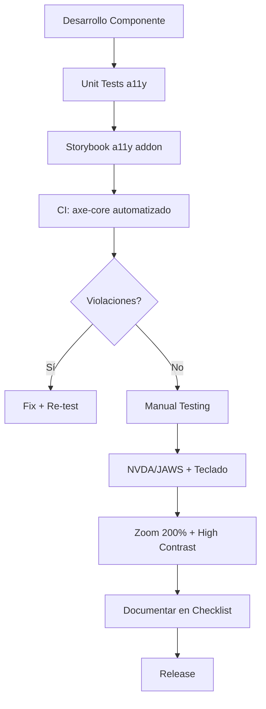

---
tags:
  - kanban/todo
  - type/task
  - domain/UX
  - priority/P2
parent: "[[desarrollo]]"
children: []
depends_on:
  - "[[UX-004]]"
blocks:
  - "[[UI-001]]"
  - "[[UI-003]]"
  - "[[TST-S-005]]"
status: todo
assignee: "@dev"
created: 2026-08-04
updated: 2026-08-04
---

# [[UX-006]] Accesibilidad: Auditoría WCAG 2.1 AA Plan + Checklists

## Descripción
Definir plan de accesibilidad WCAG 2.1 nivel AA: checklist por componente, testing automatizado, testing manual con lectores de pantalla, y criterios de aceptación por feature.

## Código de Ejemplo
```markdown
# Checklist WCAG 2.1 AA por Componente

## 1. Perceivable (Perceptible)
### 1.1 Text Alternatives
- [ ] Imágenes: alt text descriptivo (no "imagen de")
- [ ] Iconos decorativos: aria-hidden="true"
- [ ] Gráficos/Charts: tabla de datos alternativa + description
- [ ] Audio/Video: transcripciones + subtítulos

### 1.3 Adaptable
- [ ] Estructura semántica HTML5 (header, main, nav, aside, section)
- [ ] Headings jerárquicos (h1-h6) sin saltos
- [ ] Labels en formularios (for/id o aria-label)
- [ ] Tablas: th + scope, caption

### 1.4 Distinguishable
- [ ] Contraste texto: 4.5:1 (normal), 3:1 (large text)
- [ ] Contraste UI: 3:1 (bordes, focus indicators)
- [ ] No solo color para info (iconos + texto)
- [ ] Resize text 200% sin pérdida funcionalidad
- [ ] Espaciado: line-height 1.5, paragraph 2x, letter 0.12x, word 0.16x

## 2. Operable (Operable)
### 2.1 Keyboard Accessible
- [ ] Todo operable por teclado (Tab, Enter, Escape, Arrows)
- [ ] Focus visible en todos los elementos interactivos
- [ ] Skip links: "Saltar al contenido principal"
- [ ] No keyboard traps (modales cierran con Escape)

### 2.2 Enough Time
- [ ] Timeouts ajustables/extensibles (excepto tiempo real)
- [ ] Pausar/parar/ocultar contenido en movimiento (carousels)

### 2.3 Seizures
- [ ] No flashes > 3 veces/segundo
- [ ] Animaciones respectan prefers-reduced-motion

### 2.4 Navigable
- [ ] Breadcrumbs en páginas profundas
- [ ] Headings para navegación por landmarks
- [ ] Link purpose claro (no "click aquí")
- [ ] Múltiples vías: búsqueda, sitemap, navegación

## 3. Understandable (Comprensible)
### 3.1 Readable
- [ ] Lang attribute en html + cambios de idioma
- [ ] Lectura nivel secundaria (Flesch-Kincaid)

### 3.2 Predictable
- [ ] Navegación consistente
- [ ] Componentes idénticos = comportamiento idéntico
- [ ] Cambios de contexto solo a petición usuario

### 3.3 Input Assistance
- [ ] Error identification: texto + icono + aria-describedby
- [ ] Labels + instrucciones en formularios
- [ ] Sugerencias de corrección en errores
- [ ] Reversible/Confirmado en acciones legales/financieras

## 4. Robust (Robusto)
### 4.1 Compatible
- [ ] HTML válido (W3C validator)
- [ ] ARIA roles/props válidos
- [ ] Name, role, value para componentes custom
```

```php
// Testing automatizado en CI (phpunit/pest)
test('homepage passes axe-core accessibility audit', function () {
    $this->visit('/')
         ->assertAxeNoViolations(); // Requiere pest-plugin-axe o similar
});
```

## Cálculos y Algoritmos (LaTeX)
### Fórmula de Contraste (WCAG)
$$
\text{Contraste} = \frac{L_1 + 0.05}{L_2 + 0.05}
$$
Donde $L_1$ = luminancia relativa color claro, $L_2$ = color oscuro.
Target: $\geq 4.5:1$ (texto normal), $\geq 3:1$ (texto large 18pt+ / UI)

### Cobertura de Accesibilidad
$$
\text{Cobertura} = \frac{\text{Componentes auditados}}{\text{Componentes totales}} \times 100 = 100\%
$$

## Diagramas Mermaid
### Flujo de Testing Accesibilidad


## Criterios de Aceptación
- [ ] Checklist WCAG 2.1 AA completado en `docu/especificaciones/accessibility-checklist.md`
- [ ] Testing automatizado axe-core en CI (GitHub Actions)
- [ ] Testing manual: NVDA (Windows) + VoiceOver (Mac) + Teclado solo
- [ ] Zoom 200% verificado sin pérdida funcionalidad
- [ ] High contrast mode verificado (Windows + Mac)
- [ ] prefers-reduced-motion respetado en animaciones
- [ ] Skip links implementados en layouts base
- [ ] Focus visible en todos los estados interactivos
- [ ] Documentación de excepciones justificadas (si las hay)

## Notas Técnicas
- Integrar `axe-core` en tests Pest: `pest --plugin=axe`
- Storybook a11y addon para desarrollo de componentes
- Lighthouse CI en PRs (score > 95)
- Documentar patrones ARIA usados en UI-002 (component library)
- Re-auditar en cada release mayor

## Enlaces
- [[UX-001]] Proto-personas (incluir usuarios con discapacidad)
- [[UI-001]] Design Tokens (contraste tokens)
- [[UI-002]] Component Library (a11y por componente)
- [[UI-003]] Layouts (skip links, landmarks)
- [[CSS-033]] Accesibilidad CSS
- [[TST-S-005]] Pentest incluye a11y