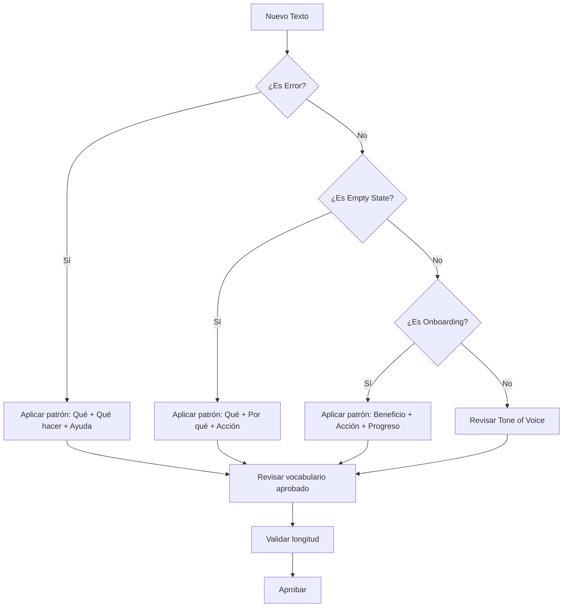

---
tags:
  - kanban/todo
  - type/task
  - domain/UX
  - priority/P3
parent: "[[desarrollo]]"
children: []
depends_on:
  - "[[UX-001]]"
blocks:
  - "[[UI-001]]"
  - "[[WEB-003]]"
  - "[[WEB-001]]"
  - "[[WEB-005]]"
status: todo
assignee: "@dev"
created: 2026-08-04
updated: 2026-08-04
---

# [[UX-007]] Microcopy + Tone of Voice Guide (Español Neutro)

## Descripción
Crear guía de microcopy y tono de voz para español neutro (Latam + España). Incluir: principios, vocabulario aprobado/prohibido, patrones de mensajes, errores, empty states, onboarding.

## Código de Ejemplo
```markdown
# Tone of Voice TG-PayGate

## Principios
1. **Claro** - Sin jerga técnica, palabras simples
2. **Humano** - Conversacional, empático, no robótico
3. **Confiable** - Transparente, honesto, seguro
4. **Útil** - Accionable, guía al usuario, reduce fricción

## Vocabulario Aprobado
| Concepto | Usar | No Usar |
|----------|------|---------|
| Usuario final | "Tú", "Tu" | "El usuario", "Usted" |
| Compra | "Comprar acceso", "Unirte" | "Adquirir", "Suscribirse" |
| Pago | "Pagar", "Confirmar pago" | "Procesar transacción" |
| Error | "Algo salió mal", "Intenta de nuevo" | "Error 500", "Falló" |
| Éxito | "¡Listo!", "Acceso concedido" | "Transacción exitosa" |
| Canal | "Canal", "Grupo" | "Comunidad", "Espacio" |

## Patrones de Mensajes

### Errores
- **Formato**: "Qué pasó + Qué hacer + Ayuda"
- **Ejemplo**: "No pudimos procesar tu pago. Verifica tu tarjeta o intenta con otro método. ¿Necesitas ayuda? [Contactar soporte]"

### Empty States
- **Formato**: "Qué hay aquí + Por qué está vacío + Qué hacer"
- **Ejemplo**: "Aún no tienes canales. Cuando compres tu primer acceso, aparecerá aquí. [Explorar canales]"

### Onboarding
- **Formato**: "Beneficio + Acción + Progreso"
- **Ejemplo**: "Configura tu canal en 3 pasos. Paso 1 de 3: Datos básicos. [Continuar]"

### Notificaciones
- **Push/Email**: Asunto < 50 chars, preview text, CTA claro
- **In-app**: Toast 3 líneas max, acción primaria + dismiss
```

```php
// Helper para microcopy consistente
// app/Helpers/Microcopy.php
class Microcopy
{
    public static function checkoutSuccess(string $channelName): string
    {
        return "¡Acceso concedido a {$channelName}! 🎉 Te hemos enviado el enlace a tu email y Telegram.";
    }
    
    public static function paymentFailed(string $reason = ''): string
    {
        $base = "No pudimos procesar tu pago.";
        return $reason ? "{$base} Motivo: {$reason}. Intenta con otro método." : "{$base} Intenta de nuevo o usa otro método.";
    }
    
    public static function subscriptionExpiring(int $days): string
    {
        return "Tu acceso a {$channel} expira en {$days} días. Renueva ahora para no perder contenido.";
    }
}
```

## Cálculos y Algoritmos (LaTeX)
### Legibilidad (Flesch-Kincaid adaptado español)
$$
\text{Índice} = 206.84 - 0.60 \times \frac{\text{sílabas}}{\text{palabras}} - 1.02 \times \frac{\text{palabras}}{\text{oraciones}}
$$
Target: 60-70 (nivel secundaria)

### Longitud Óptima
$$
\begin{aligned}
\text{Headline} &< 60 \text{ chars} \\
\text{Body} &< 160 \text{ chars (mobile)} \\
\text{CTA} &< 25 \text{ chars} \\
\text{Error} &< 200 \text{ chars} \\
\text{Toast} &< 140 \text{ chars}
\end{aligned}
$$

## Diagramas Mermaid
### Flujo de Decisión Microcopy


## Criterios de Aceptación
- [ ] Guía completa en `docu/especificaciones/microcopy-guide.md`
- [ ] Principios de tono de voz definidos (4 principios)
- [ ] Tabla vocabulario aprobado/prohibido (mínimo 30 entradas)
- [ ] Patrones para: errores, empty states, onboarding, notificaciones, éxito, confirmaciones
- [ ] Helper `Microcopy` class con métodos reutilizables
- [ ] Ejemplos reales para cada pantalla clave (22 wireframes)
- [ ] Glosario de términos técnicos traducidos
- [ ] Validado con hablantes nativos Latam + España

## Notas Técnicas
- Español neutro: evitar regionalismos (usar "coche/carro" → "vehículo", "computadora/ordenador" → "equipo")
- Formato de números: 1.234,56 (Latam) vs 1,234.56 (España) → usar locale del usuario
- Fechas: DD/MM/YYYY configurable por locale
- Moneda: Símbolo antes/después según locale ($100 vs 100€)
- Guardar en `docu/especificaciones/microcopy-guide.md`

## Enlaces
- [[UX-001]] Proto-personas
- [[UX-004]] Wireframes (anotaciones microcopy)
- [[UI-002]] Component Library (estados con microcopy)
- [[WEB-003]] Email Templates
- [[PUB-004]] Checkout Flow
- [[CRE-001]] Onboarding Creador