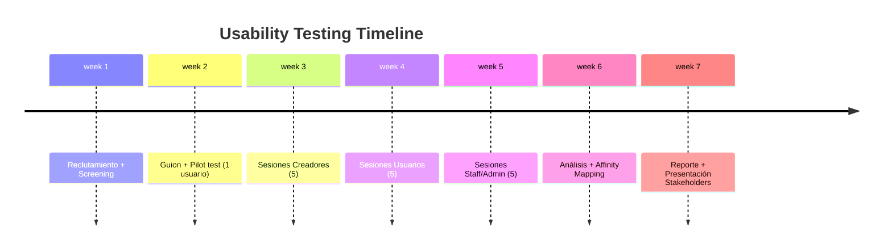

---
tags:
  - kanban/todo
  - type/task
  - domain/UX
  - priority/P2
parent: "[[desarrollo]]"
children: []
depends_on:
  - "[[UX-004]]"
  - "[[UI-002]]"
blocks:
  - "[[TST-F-012]]"
status: todo
assignee: "@dev"
created: 2026-08-04
updated: 2026-08-04
---

# [[UX-008]] Usability Testing Plan (5 Usuarios por Rol)

## Descripción
Definir plan de pruebas de usabilidad: reclutamiento, guión de prueba, métricas, tareas por rol, análisis de resultados, y reporte final. 5 usuarios por cada uno de los 4 roles = 20 sesiones.

## Código de Ejemplo
```markdown
# Plan de Usability Testing

## Objetivos
1. Validar que usuarios completan journeys críticos sin ayuda
2. Identificar pain points en onboarding creador y checkout
3. Medir time-on-task y success rate por tarea
4. Validar accesibilidad con usuarios reales

## Reclutamiento
| Rol | Cantidad | Criterios | Incentivo |
|-----|----------|-----------|-----------|
| Creador | 5 | Activo en Telegram, quiere monetizar | $50 USD + 6 meses gratis |
| Usuario Final | 5 | Compra contenido digital habitualmente | $30 USD |
| Staff/Soporte | 3 | Experiencia en atención al cliente | $40 USD |
| Admin | 2 | Experiencia gestión SaaS | $50 USD |

## Guion de Prueba (Ejemplo: Creador)

### Intro (5 min)
- Presentación, consentimiento grabación
- "No probamos ti, probamos el sistema"
- Preguntas contexto: experiencia, herramientas actuales

### Tareas (35 min)
| # | Tarea | Éxito Esperado | Métricas |
|---|-------|----------------|----------|
| 1 | Registrarse y verificar email | Completa en < 3 min | Time, Success, Errors |
| 2 | Vincular bot de Telegram | Token válido, canal detectado | Time, Success, Confusion points |
| 3 | Configurar canal con precio $10/mes | Plan creado correctamente | Time, Success, Hesitations |
| 4 | Simular primera venta (modo test) | Ve suscripción en dashboard | Time, Understanding |
| 5 | Solicitar retiro a cuenta bancaria | Form completado, entiende fees | Time, Success, Questions |

### Post-Tarea (5 min)
- SUS (System Usability Scale) - 10 preguntas
- Preguntas abiertas: "¿Qué fue más frustrante?", "¿Qué te gustó?"
- NPS: "¿Recomendarías a colega?"

## Métricas Cuantitativas
- **Success Rate**: % tareas completadas sin ayuda
- **Time on Task**: Segundos por tarea (target: < benchmark)
- **Error Rate**: Errores por tarea
- **SUS Score**: Target > 68 (promedio industria)
- **NPS**: Target > 30

## Métricas Cualitativas
- Pain points frecuentes (affinity mapping)
- Workarounds descubiertos
- Feature requests
- Lenguaje usado por usuarios (para microcopy)

## Análisis y Reporte
1. Grabar sesiones (video + audio + pantalla)
2. Transcribir momentos clave
3. Affinity mapping de observaciones
4. Priorizar fixes: Impacto × Frecuencia × Severidad
5. Reporte ejecutivo + backlog de mejoras UX
```

```mermaid
# Matriz de Priorización Fixes
graph TD
    A[Observaciones] --> B[Afinidad Mapping]
    B --> C[Clusters de Problemas]
    C --> D[Scoring: Impacto x Frecuencia x Severidad]
    D --> E{Puntuación}
    E -->|Alta > 15| F[Fix Inmediato Sprint Actual]
    E -->|Media 8-15| G[Backlog Próximo Sprint]
    E -->|Baja < 8| H[Backlog v1.1]
```

## Cálculos y Algoritmos (LaTeX)
### System Usability Scale (SUS)
$$
\text{SUS} = 2.5 \times \sum_{i=1}^{10} \text{Score}_i
$$
Donde items impares: score = respuesta - 1, pares: score = 5 - respuesta.
Target: > 68 (promedio), > 80 (excelente)

### Priorización RICE adaptada UX
$$
\text{Puntuación} = \frac{\text{Impacto} \times \text{Frecuencia} \times \text{Severidad}}{\text{Esfuerzo}}
$$
Escala 1-5 cada dimensión.

## Diagramas Mermaid
### Flujo de Testing


## Criterios de Aceptación
- [ ] Plan documentado en `docu/especificaciones/usability-testing-plan.md`
- [ ] Guion de prueba por rol (4 guiones)
- [ ] Criterios de reclutamiento y screener questionnaire
- [ ] Métricas cuantitativas definidas con targets
- [ ] 20 sesiones completadas (5 por rol)
- [ ] Grabaciones + transcripciones guardadas
- [ ] Affinity mapping completado
- [ ] Reporte final con: hallazgos, priorización, backlog mejoras
- [ ] Fixes críticos implementados antes de Beta

## Notas Técnicas
- Herramientas: Zoom/Meet + OBS (grabación), Miro/FigJam (affinity mapping)
- Pilot test obligatorio con 1 usuario antes de sesiones principales
- Consentimiento informado firmado (GDPR compliant)
- Accesibilidad: probar con usuario con discapacidad visual si posible
- Compartir hallazgos en retro semanal (KAN-006)

## Enlaces
- [[UX-001]] Proto-personas (criterios reclutamiento)
- [[UX-002]] Journey Maps (tareas basadas en journeys)
- [[UX-003]] User Flows (paths a validar)
- [[UX-006]] Accesibilidad (testing con lectores pantalla)
- [[UX-007]] Microcopy (validar lenguaje usuarios)
- [[TST-F-012]] Browser Tests (automatizar paths validados)
- [[KAN-006]] Retrospectiva (compartir hallazgos)