---
tags:
  - kanban/todo
  - type/task
  - domain/WEB
  - priority/P0
parent: "[[desarrollo]]"
children: []
depends_on:
  - "[[UI-001]]"
  - "[[UI-005]]"
  - "[[UX-004]]"
  - "[[UX-007]]"
blocks:
  - "[[WEB-002]]"
  - "[[WEB-003]]"
  - "[[WEB-004]]"
  - "[[PUB-001]]"
  - "[[CSS-001]]"
  - "[[WEB-005]]"
  - "[[WEB-006]]"
  - "[[CSS-002]]"
status: todo
assignee: "@dev"
created: 2026-08-04
updated: 2026-08-04
---

# [[WEB-001]] Brand Guidelines: Logo, Paleta, Tipografía, Voz, Do/Don't

## Descripción
Crear brand guidelines completos: logo (variantes, safe zone, usos incorrectos), paleta de colores (primaria, secundaria, semántica, neutros), tipografía (fuentes, escalas, jerarquía), voz y tono, y guía de do's/don'ts visuales.

## Paleta de Colores

### Paleta Base TG-PayGate (5 Colores Fundamentales)

| Nombre | Hex | Vista Previa | Uso Principal |
|--------|-----|--------------|---------------|
| **Dark 900** | **`#100F0F`** |  | Fondo principal dark, texto sobre light |
| **Dark 700** | **`#34312D`** |  | Fondo secundario dark, cards, sidebars |
| **Muted 500** | **`#65727C`** |  | Texto secundario, labels, placeholders, bordes |
| **Accent 400** | **`#82B7C3`** |  | **Color marca**: botones primarios, links, focus, highlights |
| **Light 100** | **`#E0E0E0`** |  | Fondo principal light, texto sobre dark, divisores |

### Tokens Semánticos por Tema (Light/Dark)

| Token | Light Mode | Dark Mode | Uso |
|-------|------------|-----------|-----|
| **bg-primary** | `` `#E0E0E0` ``  | `` `#100F0F` ``  | Fondo principal páginas |
| **bg-secondary** | `#ffffff`  | `` `#34312D` ``  | Cards, modales, inputs, sidebar |
| **bg-tertiary** | `#f5f5f5`  | `` `#1f1e1d` ``  | Hover backgrounds, stripes |
| **text-primary** | `` `#100F0F` ``  | `` `#E0E0E0` ``  | Texto principal, headings |
| **text-secondary** | `` `#34312D` ``  | `` `#a3abb2` ``  | Texto secundario, descriptions |
| **text-muted** | `` `#65727C` ``  | `` `#848d96` ``  | Placeholders, helper text, timestamps |
| **border-primary** | `` `#cccccc` ``  | `` `#424a50` ``  | Bordes inputs, cards, divisores |
| **border-focus** | `` `#82B7C3` ``  | `` `#82B7C3` ``  | Focus rings, active borders |
| **accent-primary** | `` `#82B7C3` ``  | `` `#82B7C3` ``  | Botones primarios, links, CTAs |
| **accent-hover** | `` `#6aa8b3` ``  | `` `#96cdd8` ``  | Hover states botones/links |
| **accent-active** | `` `#54949e` ``  | `` `#b9dfe5` ``  | Active/pressed states |

### Estados Semánticos (Consistentes en ambos temas)

| Token | Light | Dark | Uso |
|-------|-------|------|-----|
| **Success** | `` `#2e7d32` ``  | `` `#4caf50` ``  | Confirmaciones, checkmarks, positivos |
| **Error** | `` `#c62828` ``  | `` `#ef5350` ``  | Errores, destructivo, alertas críticas |
| **Warning** | `` `#ef6c00` ``  | `` `#ffa726` ``  | Advertencias, precaución, pendientes |
| **Info** | `` `#82B7C3` ``  | `` `#82B7C3` ``  | Informativo, ayuda, tooltips (usa accent) |

### Escalas Completas (para Design Tokens CSS)

#### Dark Scale (#100F0F → #34312D)
| Token | Hex | Light Usage | Dark Usage |
|-------|-----|-------------|------------|
| dark-50 | `` #1a1918 `` | — | bg-tertiary hover |
| dark-100 | `` #1f1e1d `` | — | bg-tertiary |
| dark-200 | `` #2a2928 `` | — | border subtle |
| dark-400 | `` #34312D `` | — | **bg-secondary** |
| dark-600 | `` #4a4642 `` | — | input bg |
| dark-800 | `` #1a1817 `` | text on light | — |
| **dark-900** | **`#100F0F`** | text-primary | **bg-primary** |
| dark-950 | `` #080707 `` | — | overlay/modal bg |

#### Accent Scale (#82B7C3)
| Token | Hex | Light Usage | Dark Usage |
|-------|-----|-------------|------------|
| accent-50 | `` #f0f9fb `` | bg subtle | — |
| accent-100 | `` #dceef2 `` | bg hover | — |
| accent-200 | `` #b9dfe5 `` | border focus | — |
| accent-300 | `` #96cdd8 `` | — | accent-hover |
| **accent-400** | **`#82B7C3`** | **accent-primary** | **accent-primary** |
| accent-500 | `` #6aa8b3 `` | accent-hover | accent-active |
| accent-600 | `` #54949e `` | text on light | — |
| accent-700 | `` #437780 `` | text on accent-50 | — |

#### Light Scale (#E0E0E0)
| Token | Hex | Light Usage | Dark Usage |
|-------|-----|-------------|------------|
| light-50 | `` #f5f5f5 `` | bg-tertiary | — |
| **light-100** | **`#E0E0E0`** | **bg-primary** | text-primary |
| light-200 | `` #cccccc `` | border-primary | — |
| light-300 | `` #b3b3b3 `` | placeholder | — |
| light-400 | `` #999999 `` | text-muted light | — |
| light-500 | `` #808080 `` | text-secondary light | — |

#### Muted Scale (#65727C)
| Token         | Hex           | Light Usage       | Dark Usage          |
| ------------- | ------------- | ----------------- | ------------------- |
| muted-50      | `` #e8ebec `` | bg subtle         | —                   |
| muted-100     | `` #d1d6d8 `` | hover neutral     | —                   |
| muted-200     | `` #a3abb2 `` | border inputs     | text-secondary dark |
| muted-300     | `` #848d96 `` | labels/helper     | text-muted dark     |
| **muted-400** | **`#65727C`** | **text-muted**    | —                   |
| muted-500     | `` #525c64 `` | text on light-100 | —                   |
| muted-600     | `` #424a50 `` | text on white     | border-primary dark |

## Tipografía

### Fuente Principal: Inter
- **Fuente**: Inter (Variable font: opsz, wght, slnt)
- **Fallback**: system-ui, -apple-system, BlinkMacSystemFont, "Segoe UI", Roboto, sans-serif
- **Pesos**: 400 (Regular), 500 (Medium), 600 (Semibold), 700 (Bold)
- **Carga**: `@font-face` local + `font-display: swap` + preload

### Fuente Mono: JetBrains Mono
- **Uso**: Código, tokens API, montos, IDs
- **Pesos**: 400, 500

### Jerarquía Tipográfica
| Elemento | Desktop | Mobile | Peso | Line Height |
|----------|---------|--------|------|-------------|
| H1 (Hero) | clamp(2.5rem, 5vw, 4rem) | clamp(2rem, 8vw, 3rem) | 700 | 1.1 |
| H2 (Section) | clamp(1.75rem, 3vw, 2.25rem) | clamp(1.5rem, 4vw, 2rem) | 600 | 1.2 |
| H3 (Card) | 1.25rem | 1.125rem | 600 | 1.3 |
| Body Large | 1.125rem | 1rem | 400 | 1.6 |
| Body | 1rem | 1rem | 400 | 1.5 |
| Small | 0.875rem | 0.875rem | 400 | 1.5 |
| Caption | 0.75rem | 0.75rem | 500 | 1.4 |

## Voz y Tono (Ref: UX-007)
- **Claro**: Sin jerga, palabras simples
- **Humano**: Conversacional, empático
- **Confiable**: Transparente, honesto
- **Útil**: Accionable, guía al usuario

## Do's y Don'ts Visuales

### ✅ Do's
- Usar grid de 8px (spacing tokens) para todo layout
- Mantener contraste WCAG AA en todos los pares
- Usar ilustraciones custom (UI-007) no stock photos
- Iconos outline style consistente (UI-006)
- Animaciones sutiles, purpose-driven (UI-008)
- Dark mode como first-class citizen (UI-005)

### ❌ Don'ts
- No usar sombras pesadas (max shadow-md)
- No usar gradientes en texto (legibilidad)
- No mezclar border-radius (usar tokens: sm, md, lg, full)
- No hardcodear colores (siempre tokens semánticos)
- No animar width/height/top/left (usar transform)
- No usar más de 2 fuentes (Inter + JetBrains Mono)

## Cálculos y Algoritmos (LaTeX)
### Safe Zone Logo
$$
\text{Safe Zone} = 1 \times \text{altura}(T_{\text{logo}}) \quad \text{en los 4 lados}
$$

### Contraste Mínimo WCAG AA
$$
\frac{L_{\text{claro}} + 0.05}{L_{\text{oscuro}} + 0.05} \geq 
\begin{cases}
4.5:1 & \text{texto normal} \\
3:1 & \text{texto large (18pt+/14pt+ bold)} \\
3:1 & \text{UI components}
\end{cases}
$$

### Escalado Fluido Tipografía
$$
\text{clamp}(min, preferred, max) = \text{clamp}(1.5rem, 3vw, 2.5rem)
$$

## Diagramas Mermaid
### Sistema Visual Completo

```mermaid
graph TD
    A[Brand Guidelines] --> B[Logo System]
    A --> C[Color System]
    A --> D[Typography System]
    A --> E[Iconography]
    A --> F[Illustration Style]
    A --> G[Voice & Tone]
    A --> H[Do/Don't]
    
    B --> B1[Horizontal + Vertical + Icon]
    B --> B2[Safe Zone + Min Size]
    B --> B3[Color Variants]
    
    C --> C1[Base Palette: 5 Colors]
    C --> C2[Semantic Tokens Light/Dark]
    C --> C3[Dark Scale 8 steps]
    C --> C4[Accent Scale 7 steps]
    C --> C5[Light Scale 6 steps]
    C --> C6[Muted Scale 7 steps]
    C --> C7[Semantic: Success/Error/Warning/Info]
    
    D --> D1[Inter Variable Font]
    D --> D2[JetBrains Mono]
    D --> D3[Scale: clamp fluid]
    D --> D4[Hierarchy: H1-H3, Body, Small]
    
    E --> E1[Heroicons Outline]
    E --> E2[Custom SVG Domain]
    
    F --> F1[Outline Style]
    F --> F2[1-2 Colors Max]
    F --> F3[ViewBox 200x200]
```

## Criterios de Aceptación
- [ ] Documento completo en `docu/especificaciones/brand-guidelines.md`
- [ ] Logo: 3 variantes (horizontal, vertical, icon) en SVG optimizado
- [ ] Safe zone y tamaños mínimos documentados
- [ ] Paleta completa: **Base (5) + Semantic tokens Light/Dark (10) + Dark scale (8) + Accent scale (7) + Light scale (6) + Muted scale (7) + Semantic states (4)**
- [ ] Tabla de tokens semánticos con vista previa de color (HTML inline ``)
- [ ] Contraste WCAG AA validado para todos los pares Light/Dark
- [ ] Tipografía: Inter + JetBrains Mono, variable fonts, jerarquía clamp()
- [ ] Voz y tono: 4 principios + ejemplos por contexto
- [ ] Do's/Don'ts: 10+ cada uno con capturas visuales
- [ ] Assets exportados: `public/brand/` (logos, favicons, og-image-template)
- [ ] Checklist de revisión para nuevos diseños

## Notas Técnicas
- Logo SVG: viewBox 0 0 200 60 (horizontal), 60x200 (vertical), 60x60 (icon)
- Favicon set: 16, 32, 48, 64, 128, 256, 512 + manifest.json + apple-touch-icon
- OG Image template: 1200x630px con placeholders dinámicos (canal, creador)
- Fuentes: self-hosted en `public/fonts/` + preload + font-display: swap
- Variable font Inter: un archivo .woff2 con opsz, wght, slnt axes
- **Tokens CSS**: `--color-dark-900` (`#100F0F`), `--color-accent-400` (`#82B7C3`), `--color-light-100` (`#E0E0E0`), `--color-muted-400` (`#65727C`)

## Enlaces
- [[UI-001]] Design Tokens (implementación técnica)
- [[UI-005]] Dark Mode (color tokens duales)
- [[UI-006]] Iconografía (estilo visual)
- [[UI-007]] Ilustraciones (estilo visual)
- [[UX-007]] Microcopy (voz y tono)
- [[WEB-002]] Favicon Set + PWA Manifest
- [[WEB-003]] Email Templates
- [[WEB-004]] Landing Assets
- [[CSS-002]] Design Tokens CSS
- [[CSS-003]] Tipografía CSSe, usos in