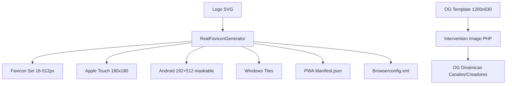

---
tags:
  - kanban/todo
  - type/task
  - domain/WEB
  - priority/P1
parent: "[[desarrollo]]"
children: []
depends_on:
  - "[[WEB-001]]"
blocks:
  - "[[PUB-001]]"
  - "[[CRE-001]]"
  - "[[ADM-001]]"
  - "[[CRM-001]]"
  - "[[CSS-034]]"
status: todo
assignee: "@dev"
created: 2026-08-04
updated: 2026-08-04
---

# [[WEB-002]] Favicon Set + PWA Manifest + Apple Touch Icons + OG Image Template

## Descripción
Generar conjunto completo de favicons multi-resolución, PWA manifest para instalabilidad, apple-touch-icons iOS, y template de Open Graph image dinámico para compartir en redes sociales/Telegram.

## Código de Ejemplo
```bash
# Generar favicons desde logo SVG
npx @realfavicongenerator/cli --input public/brand/logo-icon.svg --output public/favicons --config favicon-config.json
```

```json
// public/manifest.json (PWA)
{
  "name": "TG-PayGate",
  "short_name": "TG-PayGate",
  "description": "Plataforma de gestión de contenido de pago vía Telegram",
  "start_url": "/",
  "display": "standalone",
  "background_color": "#E0E0E0",
  "theme_color": "#82B7C3",
  "orientation": "portrait-primary",
  "icons": [
    { "src": "/favicons/android-chrome-192x192.png", "sizes": "192x192", "type": "image/png", "purpose": "any maskable" },
    { "src": "/favicons/android-chrome-512x512.png", "sizes": "512x512", "type": "image/png", "purpose": "any maskable" }
  ],
  "categories": ["business", "finance", "productivity"],
  "shortcuts": [
    { "name": "Explorar Canales", "url": "/canales", "description": "Ver canales disponibles" },
    { "name": "Mi Cuenta", "url": "/dashboard", "description": "Acceder a mi dashboard" }
  ]
}
```

```html
<!-- HTML Head - Favicons + PWA + OG -->
<head>
  <link rel="icon" type="image/svg+xml" href="/favicons/favicon.svg">
  <link rel="icon" type="image/png" sizes="32x32" href="/favicons/favicon-32x32.png">
  <link rel="icon" type="image/png" sizes="16x16" href="/favicons/favicon-16x16.png">
  <link rel="apple-touch-icon" sizes="180x180" href="/favicons/apple-touch-icon.png">
  <link rel="manifest" href="/manifest.json">
  <meta name="theme-color" content="#82B7C3" media="(prefers-color-scheme: light)">
  <meta name="theme-color" content="#100F0F" media="(prefers-color-scheme: dark)">
  <meta name="msapplication-config" content="/favicons/browserconfig.xml">
  
  <!-- Open Graph dinámico -->
  <meta property="og:type" content="website">
  <meta property="og:site_name" content="TG-PayGate">
  <meta property="og:url" content="{{ request()->url() }}">
  <meta property="og:title" content="{{ $ogTitle ?? config('app.name') }}">
  <meta property="og:description" content="{{ $ogDescription ?? 'Plataforma de gestión de contenido de pago vía Telegram' }}">
  <meta property="og:image" content="{{ $ogImage ?? asset('favicons/og-image-default.png') }}">
  <meta property="og:image:width" content="1200">
  <meta property="og:image:height" content="630">
  <meta property="og:image:alt" content="{{ $ogImageAlt ?? 'TG-PayGate' }}">
  <meta property="og:locale" content="es_ES">
  
  <!-- Twitter Card -->
  <meta name="twitter:card" content="summary_large_image">
  <meta name="twitter:site" content="@tgpaygate">
  <meta name="twitter:creator" content="@tgpaygate">
</head>
```

```php
// app/Services/OgImageGenerator.php - Para OG dinámicas
class OgImageGenerator
{
    public function generateChannelOgImage(CanalPago $canal): string
    {
        $template = Image::make(public_path('brand/og-template.png'));
        $template->text($canal->name, 600, 200, function ($font) {
            $font->file(public_path('fonts/Inter-Bold.woff2'));
            $font->size(64);
            $font->color('#ffffff');
            $font->align('center');
            $font->valign('top');
        });
        $template->text("{$canal->subscribers_count} suscriptores", 600, 300, function ($font) {
            $font->file(public_path('fonts/Inter-Regular.woff2'));
            $font->size(32);
            $font->color('#82B7C3');
            $font->align('center');
        });
        $filename = "og-channel-{$canal->slug}-" . time() . ".png";
        $path = public_path("storage/og-images/{$filename}");
        $template->save($path);
        return asset("storage/og-images/{$filename}");
    }
}
```

## Cálculos y Algoritmos (LaTeX)
### Tamaños Favicon Requeridos
$$
\text{Sizes} = \{ 16, 32, 48, 64, 128, 192, 256, 512 \} \text{px}
$$

### OG Image Aspect Ratio
$$
\frac{1200}{630} = 1.91:1
$$

### PWA Installability
$$
\text{Instalable} \iff \text{Manifest} \land \text{Service Worker} \land \text{HTTPS} \land \text{Icons 192+512}
$$

## Diagramas Mermaid


## Criterios de Aceptación
- [ ] Favicon set completo en `public/favicons/` (16-512px, .ico, .png, .svg)
- [ ] Apple touch icon 180x180px
- [ ] Android Chrome icons 192x192 + 512x512 (maskable)
- [ ] Windows tiles 150x150 + 310x310
- [ ] PWA `manifest.json` válido (name, short_name, icons, theme_color, display: standalone)
- [ ] `browserconfig.xml` para Windows
- [ ] OG image template 1200x630px en `public/brand/og-template.png`
- [ ] Componente `<x-og-meta>` reutilizable con props
- [ ] Servicio `OgImageGenerator` para imágenes dinámicas
- [ ] Testing: Facebook Sharing Debugger, Twitter Card Validator, Telegram Bot API
- [ ] Lighthouse PWA audit > 90

## Notas Técnicas
- Usar `realfavicongenerator.net` o CLI para generar set completo desde logo SVG
- Versionado: `?v=1.0.0` en URLs para cache busting
- OG images dinámicas: cache 24h, regenerar si datos cambian
- Telegram usa OG tags + `og:image` para preview en chats
- Maskable icons: safe zone 40% centrado (adaptive icons Android)

## Enlaces
- [[WEB-001]] Brand Guidelines
- [[PUB-001]] Landing Page
- [[PUB-002]] Listado Canales (OG dinámico)
- [[CRE-001]] Dashboard Creador (PWA install)
- [[CSS-034]] Build System