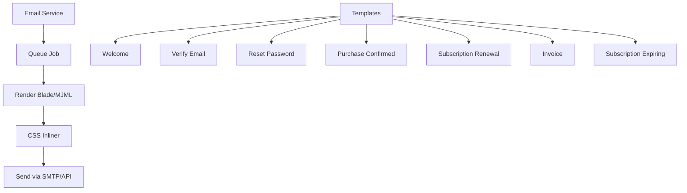

---
tags:
  - kanban/todo
  - type/task
  - domain/WEB
  - priority/P1
parent: "[[desarrollo]]"
children: []
depends_on:
  - "[[WEB-001]]"
blocks:
  - "[[PUB-001]]"
  - "[[CRE-001]]"
  - "[[ADM-001]]"
  - "[[CRM-001]]"
status: todo
assignee: "@dev"
created: 2026-08-04
updated: 2026-08-04
---

# [[WEB-003]] Email Templates: Base Transaccional (MJML/Blade), 6+ Templates

## Descripción
Crear sistema de emails transaccionales con templates responsivos usando MJML o Blade components. 6+ templates: bienvenida, verificación email, reset password, confirmación compra, notificación suscripción, factura.

## Código de Ejemplo
```php
// resources/views/emails/welcome.blade.php
<x-email-layout>
    <x-email-header />
    
    <div class="email-content">
        <h1>¡Bienvenido a TG-PayGate, {{ $user->name }}! 🎉</h1>
        <p>Tu cuenta ha sido creada exitosamente. Ahora puedes:</p>
        <ul>
            <li>Explorar canales premium</li>
            <li>Comprar accesos con un click</li>
            <li>Gestionar tus suscripciones</li>
        </ul>
        <x-button :url="route('channels.index')" variant="primary">Explorar Canales</x-button>
    </div>
    
    <x-email-footer />
</x-email-layout>
```

```php
// resources/views/emails/purchase-confirmed.blade.php
<x-email-layout>
    <x-email-header />
    
    <div class="email-content">
        <div class="success-badge">✅ Pago confirmado</div>
        <h1>¡Acceso concedido a {{ $channel->name }}!</h1>
        <p>Tu pago de <strong>{{ $amount }} {{ $currency }}</strong> ha sido procesado.</p>
        
        <div class="invite-link">
            <p>Tu enlace de invitación único:</p>
            <a href="{{ $inviteLink }}" class="btn-primary">{{ $inviteLink }}</a>
            <p class="small">Expira en 24 horas. Un solo uso.</p>
        </div>
        
        <x-button :url="$inviteLink" variant="primary">Unirme al Canal en Telegram</x-button>
    </div>
    
    <x-email-footer />
</x-email-layout>
```

```php
// app/Mail/WelcomeEmail.php
class WelcomeEmail extends Mailable
{
    use Queueable, SerializesModels;
    
    public function __construct(public User $user) {}
    
    public function build(): static
    {
        return $this->subject('¡Bienvenido a TG-PayGate!')
                    ->markdown('emails.welcome', ['user' => $this->user]);
    }
}
```

## Cálculos y Algoritmos (LaTeX)
### Responsive Email Width
$$
\text{Max Width} = 600px \quad \text{(estándar email clients)}
$$
$$
\text{Mobile} = 100\% \quad \text{con media queries}
$$

## Diagramas Mermaid


## Criterios de Aceptación
- [ ] Layout base `<x-email-layout>` con header, content, footer
- [ ] 7 templates: welcome, verify, reset-password, purchase-confirmed, subscription-renewal, invoice, expiring-soon
- [ ] Responsive: 600px max desktop, 100% mobile
- [ ] Dark mode compatible (media query prefers-color-scheme)
- [ ] Inline CSS automático (CSS inliner)
- [ ] Tests: render en Litmus/Email on Acid, Gmail, Outlook, Apple Mail
- [ ] Variables dinámicas: user, channel, amount, inviteLink, dates
- [ ] Colores usando tokens semánticos (accent, success, error)

## Notas Técnicas
- MJML recomendado para compatibilidad cross-client, o Blade + CSS inliner
- Preheader text oculto para preview en bandeja entrada
- Unsubscribe link obligatorio (GDPR/CAN-SPAM)
- Queue jobs para envío asíncrono
- Template factura: tabla items, totales, datos fiscales

## Enlaces
- [[WEB-001]] Brand Guidelines (colores, tipografía)
- [[WEB-002]] OG Images (mismo estilo visual)
- [[PUB-004]] Checkout Flow (trigger purchase email)
- [[CRE-006]] Retiros (trigger payout email)
- [[CLI-004]] Facturación (invoice email)