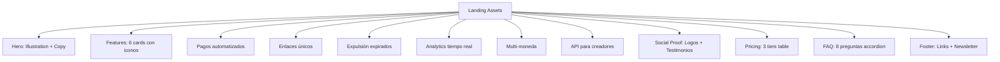

---
tags:
  - kanban/todo
  - type/task
  - domain/WEB
  - priority/P1
parent: "[[desarrollo]]"
children: []
depends_on:
  - "[[WEB-001]]"
  - "[[UX-004]]"
blocks:
  - "[[PUB-001]]"
  - "[[CSS-007]]"
status: todo
assignee: "@dev"
created: 2026-08-04
updated: 2026-08-04
---

# [[WEB-004]] Landing Page Assets: Hero, Features, Testimonials, Pricing, FAQ, Footer

## Descripción
Crear assets visuales para landing page: hero section, features grid, social proof/testimonials, pricing tables, FAQ accordion, footer. Exportar como SVG/PNG optimizados.

## Código de Ejemplo
```blade
{{-- resources/views/domains/public/partials/hero.blade.php --}}
<section class="hero relative overflow-hidden bg-gradient-to-b from-accent-50 to-white dark:from-dark-900 dark:to-dark-800">
    <div class="container mx-auto px-4 py-20 lg:py-32">
        <div class="max-w-3xl mx-auto text-center">
            <span class="inline-block px-3 py-1 rounded-full bg-accent-100 text-accent-700 dark:bg-accent-900 dark:text-accent-300 text-sm font-medium mb-6">
                Nuevo: Monetiza tu canal de Telegram en minutos
            </span>
            <h1 class="text-4xl lg:text-6xl font-bold text-text-primary mb-6 leading-tight">
                Vende accesos a tu canal<br><span class="text-accent-primary">sin complicaciones</span>
            </h1>
            <p class="text-lg lg:text-xl text-text-secondary mb-8 max-w-2xl mx-auto">
                Automatiza pagos, genera enlaces de invitación únicos y expulsa usuarios expirados. Todo desde un panel intuitivo.
            </p>
            <div class="flex flex-col sm:flex-row items-center justify-center gap-4">
                <a href="{{ route('creadores.register') }}" class="btn btn--primary btn--lg w-full sm:w-auto">
                    Empezar gratis
                    <x-icon name="arrow-right" class="ml-2" />
                </a>
                <a href="{{ route('channels.index') }}" class="btn btn--ghost btn--lg w-full sm:w-auto">
                    Ver canales
                </a>
            </div>
            <p class="mt-6 text-sm text-text-muted">Sin tarjeta de crédito • Setup en 5 min • Cancelar cuando quieras</p>
        </div>
        
        {{-- Hero Illustration --}}
        <div class="mt-16 relative">
            
        </div>
    </div>
</section>
```

```blade
{{-- Pricing Table --}}
<section class="pricing py-20 bg-white dark:bg-dark-900">
    <div class="container mx-auto px-4">
        <header class="text-center mb-16">
            <h2 class="text-3xl lg:text-4xl font-bold text-text-primary mb-4">Precios transparentes</h2>
            <p class="text-text-secondary max-w-2xl mx-auto">Solo pagas cuando ganas. Sin cuotas mensuales fijas.</p>
        </header>
        
        <div class="grid grid-cols-1 md:grid-cols-3 gap-8 max-w-5xl mx-auto">
            @foreach(['starter' => 'Iniciando', 'pro' => 'Profesional', 'enterprise' => 'Empresarial'] as $key => $label)
                <article class="pricing-card relative rounded-2xl border border-border-primary bg-bg-secondary p-8 hover:border-accent-primary hover:shadow-lg transition-all">
                    @if($key === 'pro')
                        <div class="absolute -top-3 left-1/2 -translate-x-1/2">
                            <span class="badge badge--accent">Más popular</span>
                        </div>
                    @endif
                    
                    <h3 class="text-xl font-semibold text-text-primary mb-2">{{ $label }}</h3>
                    <div class="mb-6">
                        <span class="text-4xl font-bold text-text-primary">5%</span>
                        <span class="text-text-muted"> + fee pasarela</span>
                    </div>
                    <ul class="space-y-3 mb-8">
                        <li class="flex items-center gap-2 text-text-secondary"><x-icon name="check" class="text-accent-primary" /> Canales ilimitados</li>
                        <li class="flex items-center gap-2 text-text-secondary"><x-icon name="check" class="text-accent-primary" /> Analytics básico</li>
                        @if($key !== 'starter')
                            <li class="flex items-center gap-2 text-text-secondary"><x-icon name="check" class="text-accent-primary" /> Analytics avanzado</li>
                            <li class="flex items-center gap-2 text-text-secondary"><x-icon name="check" class="text-accent-primary" /> API access</li>
                        @endif
                        @if($key === 'enterprise')
                            <li class="flex items-center gap-2 text-text-secondary"><x-icon name="check" class="text-accent-primary" /> White-label</li>
                            <li class="flex items-center gap-2 text-text-secondary"><x-icon name="check" class="text-accent-primary" /> Soporte prioritario</li>
                        @endif
                    </ul>
                    <a href="{{ route('creadores.register') }}" class="btn btn--{{ $key === 'pro' ? 'primary' : 'ghost' }} btn--full-width">
                        {{ $key === 'pro' ? 'Empezar ahora' : 'Seleccionar' }}
                    </a>
                </article>
            @endforeach
        </div>
    </div>
</section>
```

## Diagramas Mermaid


## Criterios de Aceptación
- [ ] Hero illustration SVG (dashboard preview mockup)
- [ ] 6 feature cards con iconos Heroicons + copy persuasivo
- [ ] Social proof: 8+ logos partners + 3 testimoniales con avatar
- [ ] Pricing table: 3 tiers (Starter/Pro/Enterprise) con toggle mensual/anual
- [ ] FAQ accordion: 8 preguntas (pagos, comisiones, Telegram, soporte, etc.)
- [ ] Footer: 4 columnas (Producto, Empresa, Legal, Newsletter)
- [ ] Assets exportados: `public/images/landing/` (SVG optimizados + PNG fallback)
- [ ] Responsive: mobile-first, breakpoints en UI-004
- [ ] Dark mode compatible usando tokens semánticos

## Notas Técnicas
- Ilustraciones estilo outline (UI-007), max 2 colores por asset
- SVGO para optimizar SVGs (eliminar metadata, minificar)
- Pricing toggle: Alpine.js para switch mensual/anual
- FAQ: Alpine.js accordion con animación slide
- Newsletter: honeypot + reCAPTCHA v3 invisible

## Enlaces
- [[WEB-001]] Brand Guidelines
- [[WEB-002]] OG Image Template
- [[PUB-001]] Landing Page (ensambla estos assets)
- [[UI-006]] Iconografía (feature icons)
- [[UI-007]] Ilustraciones (hero illustration)
- [[UI-008]] Motion (FAQ accordion, pricing toggle)