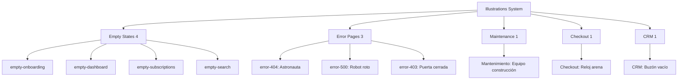

---
tags:
  - kanban/todo
  - type/task
  - domain/WEB
  - priority/P2
parent: "[[desarrollo]]"
children: []
depends_on:
  - "[[WEB-001]]"
  - "[[UX-007]]"
blocks:
  - "[[PUB-001]]"
  - "[[CRE-001]]"
  - "[[ADM-001]]"
  - "[[CRM-001]]"
status: todo
assignee: "@dev"
created: 2026-08-04
updated: 2026-08-04
---

# [[WEB-005]] Ilustraciones Custom: Onboarding, Empty States, Error Pages (404, 500, 403)

## Descripción
Crear ilustraciones custom SVG para momentos clave: onboarding steps, empty states, páginas de error (404, 500, 403), mantenimiento. Estilo outline consistente con brand, max 2 colores.

## Código de Ejemplo
```svg
<!-- resources/svg/illustrations/empty-onboarding.svg -->
<svg viewBox="0 0 200 200" fill="none" xmlns="http://www.w3.org/2000/svg">
    <!-- Person exploring with magnifying glass -->
    <path d="M100 180 C70 180 45 155 45 125 C45 95 70 70 100 70 C130 70 155 95 155 125 C155 140 145 152 130 158" stroke="#82B7C3" stroke-width="2" stroke-linecap="round" stroke-linejoin="round"/>
    <circle cx="140" cy="90" r="25" stroke="#82B7C3" stroke-width="2"/>
    <path d="M158 108 L175 125" stroke="#82B7C3" stroke-width="2" stroke-linecap="round"/>
    <!-- Thought bubble with channel icon -->
    <path d="M60 50 Q50 50 45 60 Q45 80 60 80 Q70 80 70 70 Q70 50 60 50" stroke="#65727C" stroke-width="1.5" fill="#f5f5f5" opacity="0.5"/>
    <rect x="52" y="58" width="12" height="8" rx="1" fill="#82B7C3"/>
    <rect x="52" y="70" width="8" height="4" rx="1" fill="#65727C"/>
</svg>
```

```blade
{{-- Componente Empty State Reutilizable --}}
@props(['illustration', 'title', 'description', 'ctaText', 'ctaUrl', 'secondaryCta'])

<div class="empty-state flex flex-col items-center text-center py-16 px-4">
    <div class="mb-6" x-data="{ loaded: false }" x-intersect:enter="loaded = true" :class="loaded ? 'animate-fade-in-up' : 'opacity-0'">
        <svg class="w-32 h-32 mx-auto text-text-muted" viewBox="0 0 200 200" fill="none">
            @include("illustrations.{{ $illustration }}")
        </svg>
    </div>
    <h3 class="text-xl font-semibold text-text-primary mb-2">{{ $title }}</h3>
    <p class="text-text-secondary mb-6 max-w-md mx-auto">{{ $description }}</p>
    <div class="flex flex-col sm:flex-row items-center justify-center gap-3">
        @if($ctaText && $ctaUrl)
            <a href="{{ $ctaUrl }}" class="btn btn--primary">{{ $ctaText }}</a>
        @endif
        @if($secondaryCta)
            <a href="{{ $secondaryCta['url'] }}" class="btn btn--ghost">{{ $secondaryCta['text'] }}</a>
        @endif
    </div>
</div>
```

## Lista de Ilustraciones Requeridas

| # | Archivo | Contexto | Copy Principal | CTA |
|---|---------|----------|----------------|-----|
| 1 | `empty-onboarding.svg` | Landing categorías vacías | "Aún no hay canales en esta categoría" | "Crear mi canal" |
| 2 | `empty-dashboard.svg` | Dashboard creador sin canales | "¡Todo listo! Crea tu primer canal" | "Crear canal" |
| 3 | `empty-subscriptions.svg` | Usuario sin compras | "No tienes accesos activos aún" | "Explorar canales" |
| 4 | `empty-search.svg` | Búsqueda sin resultados | "No encontramos canales con esos filtros" | "Limpiar filtros" |
| 5 | `error-404.svg` | Página no encontrada | "Parece que te perdiste en el espacio" | "Volver al inicio" |
| 6 | `error-500.svg` | Error servidor | "Algo salió mal de nuestro lado" | "Reintentar" |
| 7 | `error-403.svg` | Acceso denegado | "No tienes permiso para ver esto" | "Volver al dashboard" |
| 8 | `maintenance.svg` | Modo mantenimiento | "Estamos mejorando la plataforma" | "Suscribirme a updates" |
| 9 | `empty-checkout.svg` | Checkout sesión expirada | "Tu sesión expiró. El canal te espera" | "Volver al canal" |
| 10 | `empty-tickets.svg` | CRM sin tickets | "¡Buen trabajo! No hay tickets pendientes" | "Ver todos" |

## Diagramas Mermaid


## Criterios de Aceptación
- [ ] 10 ilustraciones SVG en `resources/svg/illustrations/`
- [ ] ViewBox 200x200, stroke-width 1.5-2, estilo outline
- [ ] Paleta: 1 color acento (#82B7C3) + muted (#65727C) + neutros
- [ ] Componente `<x-empty-state>` reutilizable con props
- [ ] Animación fade-in-up con Intersection Observer (respeta reduced-motion)
- [ ] Dark mode compatible (stroke currentColor o tokens)
- [ ] Responsive: 128px mobile, 160px desktop
- [ ] Optimizadas con SVGO

## Notas Técnicas
- Estilo outline minimalista (similar Undraw/Open Doodles pero custom)
- Sprites SVG para carga única: `<symbol id="ill-empty-onboarding">`
- Fallback emoji si SVG falla
- Copy desde guía microcopy (UX-007)

## Enlaces
- [[WEB-001]] Brand Guidelines
- [[UX-007]] Microcopy (copy por estado)
- [[UI-007]] Ilustraciones (referencia estilo)
- [[UI-005]] Dark Mode (tokens)
- [[UI-008]] Motion (animación entrada)
- [[PUB-001]] Landing (empty categories)
- [[CRE-001]] Dashboard (empty channels)
- [[CRM-001]] Ticketing (empty queue)
- [[CSS-021]] Data Display (empty state variant)