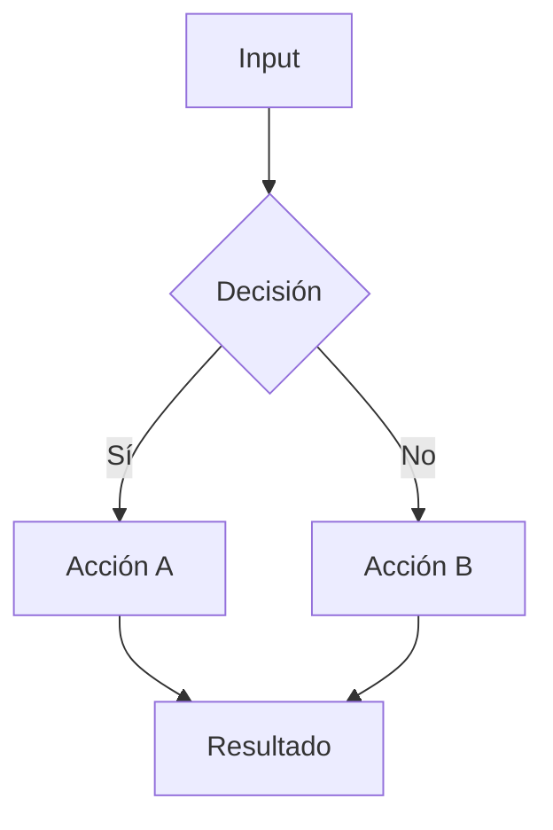
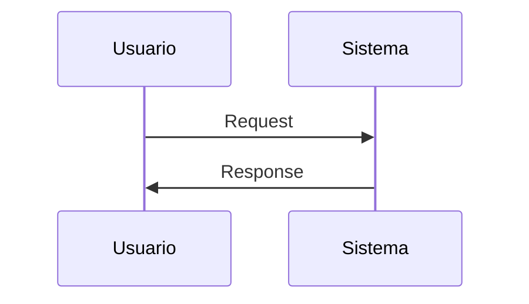

---
tags:
  - kanban/todo
  - type/task
  - domain/DOMAIN_CODE
  - priority/P0
parent: "[[desarrollo]]"
children: []
depends_on: []
blocks: []
status: todo
assignee: "@dev"
created: 2026-08-04
updated: 2026-08-04
---

# [[TASK-ID]] Título Descriptivo de la Tarea

## Descripción
Explicación detallada en español del qué y por qué.

## Código de Ejemplo
```php
// Ejemplo Laravel/PHP
class EjemploService 
{
    public function calcular(): float 
    {
        return 42.0;
    }
}
```

```blade
{{-- Ejemplo Blade --}}
<div class="btn btn--primary">{{ $texto }}</div>
```

```css
/* Ejemplo CSS */
.btn--primary { 
  background: var(--color-primary-600); 
}
```

## Cálculos y Algoritmos (LaTeX)
### Fórmula de Ejemplo
$$WSJF = \frac{User\ Business\ Value + Time\ Criticality + Risk\ Reduction}{Job\ Size}$$

### Algoritmo de Ejemplo


## Diagramas Mermaid
### Flujo de Proceso


## Criterios de Aceptación
- [ ] Criterio verificable 1
- [ ] Criterio verificable 2

## Notas Técnicas
Detalles de implementación, edge cases, referencias.

## Enlaces
- [[TASK-ID-DEPENDENCY]] Dependencia
- [[TASK-ID-NEXT]] Siguiente